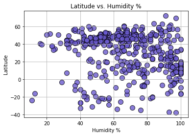
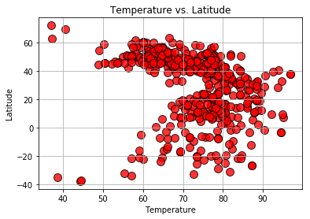
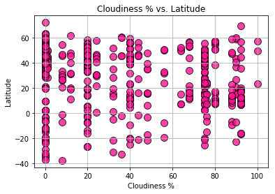
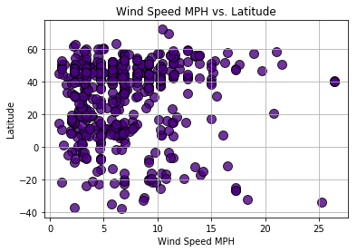

```python
import matplotlib.pyplot as plt
import requests as req
import pandas as pd
import json
import openweathermapy
import csv
api_key = "25bc90a1196e6f153eece0bc0b0fc9eb"
#api_key = "924783bda048569443e49dd6a03e5591"
```


```python
cities_pd = pd.read_csv("worldcities.csv")

# Preview the data
cities_pd.head()
```


<div>
<style>
    .dataframe thead tr:only-child th {
        text-align: right;
    }

    .dataframe thead th {
        text-align: left;
    }

    .dataframe tbody tr th {
        vertical-align: top;
    }
</style>
<table border="1" class="dataframe">
  <thead>
    <tr style="text-align: right;">
      <th></th>
      <th>Country</th>
      <th>City</th>
      <th>Latitude</th>
      <th>Longitude</th>
    </tr>
  </thead>
  <tbody>
    <tr>
      <th>0</th>
      <td>ad</td>
      <td>andorra la vella</td>
      <td>42.500000</td>
      <td>1.516667</td>
    </tr>
    <tr>
      <th>1</th>
      <td>ad</td>
      <td>canillo</td>
      <td>42.566667</td>
      <td>1.600000</td>
    </tr>
    <tr>
      <th>2</th>
      <td>ad</td>
      <td>encamp</td>
      <td>42.533333</td>
      <td>1.583333</td>
    </tr>
    <tr>
      <th>3</th>
      <td>ad</td>
      <td>la massana</td>
      <td>42.550000</td>
      <td>1.516667</td>
    </tr>
    <tr>
      <th>4</th>
      <td>ad</td>
      <td>les escaldes</td>
      <td>42.500000</td>
      <td>1.533333</td>
    </tr>
  </tbody>
</table>
</div>


```python
# # Counter

equator = equator[equator["Latitude"]
                              .astype(int) <= 30]
equator = cities_pd.sample(n=500)
equator.head()
```


<div>
<style>
    .dataframe thead tr:only-child th {
        text-align: right;
    }

    .dataframe thead th {
        text-align: left;
    }

    .dataframe tbody tr th {
        vertical-align: top;
    }
</style>
<table border="1" class="dataframe">
  <thead>
    <tr style="text-align: right;">
      <th></th>
      <th>Country</th>
      <th>City</th>
      <th>Latitude</th>
      <th>Longitude</th>
    </tr>
  </thead>
  <tbody>
    <tr>
      <th>37156</th>
      <td>ru</td>
      <td>nauchnyy gorodok</td>
      <td>53.420300</td>
      <td>83.521000</td>
    </tr>
    <tr>
      <th>33072</th>
      <td>ro</td>
      <td>fundata</td>
      <td>45.450000</td>
      <td>25.300000</td>
    </tr>
    <tr>
      <th>8089</th>
      <td>cz</td>
      <td>lostice</td>
      <td>49.745003</td>
      <td>16.930656</td>
    </tr>
    <tr>
      <th>35675</th>
      <td>ru</td>
      <td>davydovo</td>
      <td>55.608594</td>
      <td>38.861087</td>
    </tr>
    <tr>
      <th>46109</th>
      <td>us</td>
      <td>hartland</td>
      <td>43.105000</td>
      <td>-88.341944</td>
    </tr>
  </tbody>
</table>
</div>


```python
# # Counter

row_count = 1
# Generating 500 Unique Cities Names with Latitude and Longitude
for index, row in equator.iterrows():
    
    # Create endpoint URL
    #API call: api.openweathermap.org/data/2.5/weather?lat={lat}&lon={lon}
    target_url = "http://api.openweathermap.org/data/2.5/weather?&units=imperial&lat=%s&lon=%s&appid=%s" % (row["Latitude"], row["Longitude"], api_key)
    city_name = req.get(target_url).json()
    
    
    
    # Print log to ensure loop is working correctly
    print("City #" + str(row_count))  
    print(city_name["name"])
    print(target_url)
    row_count += 1
```

    City #1
    Nauchnyy Gorodok
    http://api.openweathermap.org/data/2.5/weather?&units=imperial&lat=53.4203&lon=83.521&appid=25bc90a1196e6f153eece0bc0b0fc9eb
    City #2
    Moeciu de Jos
    http://api.openweathermap.org/data/2.5/weather?&units=imperial&lat=45.45&lon=25.3&appid=25bc90a1196e6f153eece0bc0b0fc9eb
    City #3
    Lostice
    http://api.openweathermap.org/data/2.5/weather?&units=imperial&lat=49.745003000000004&lon=16.930656&appid=25bc90a1196e6f153eece0bc0b0fc9eb
    City #4
    Davydovo
    http://api.openweathermap.org/data/2.5/weather?&units=imperial&lat=55.608594&lon=38.861087&appid=25bc90a1196e6f153eece0bc0b0fc9eb
    City #5
    Hartland
    http://api.openweathermap.org/data/2.5/weather?&units=imperial&lat=43.105&lon=-88.3419444&appid=25bc90a1196e6f153eece0bc0b0fc9eb
    City #6
    Balan
    http://api.openweathermap.org/data/2.5/weather?&units=imperial&lat=46.65&lon=25.816667000000002&appid=25bc90a1196e6f153eece0bc0b0fc9eb
    City #7
    Posëlok Rabochiy
    http://api.openweathermap.org/data/2.5/weather?&units=imperial&lat=56.8519&lon=60.6122&appid=25bc90a1196e6f153eece0bc0b0fc9eb
    City #8
    Kaikalur
    http://api.openweathermap.org/data/2.5/weather?&units=imperial&lat=16.566667000000002&lon=81.2&appid=25bc90a1196e6f153eece0bc0b0fc9eb
    City #9
    Haj ve Slezsku
    http://api.openweathermap.org/data/2.5/weather?&units=imperial&lat=49.898602000000004&lon=18.098482999999998&appid=25bc90a1196e6f153eece0bc0b0fc9eb
    City #10
    Laredo
    http://api.openweathermap.org/data/2.5/weather?&units=imperial&lat=-8.1&lon=-78.95&appid=25bc90a1196e6f153eece0bc0b0fc9eb
    City #11
    Laives - Leifers
    http://api.openweathermap.org/data/2.5/weather?&units=imperial&lat=46.433333000000005&lon=11.333333&appid=25bc90a1196e6f153eece0bc0b0fc9eb
    City #12
    Baile Tusnad
    http://api.openweathermap.org/data/2.5/weather?&units=imperial&lat=46.15&lon=25.85&appid=25bc90a1196e6f153eece0bc0b0fc9eb
    City #13
    Banikoara
    http://api.openweathermap.org/data/2.5/weather?&units=imperial&lat=11.3&lon=2.4333332999999997&appid=25bc90a1196e6f153eece0bc0b0fc9eb
    City #14
    Atamanskaya
    http://api.openweathermap.org/data/2.5/weather?&units=imperial&lat=46.1773&lon=39.6358&appid=25bc90a1196e6f153eece0bc0b0fc9eb
    City #15
    Rio Claro
    http://api.openweathermap.org/data/2.5/weather?&units=imperial&lat=-22.716667&lon=-44.15&appid=25bc90a1196e6f153eece0bc0b0fc9eb
    City #16
    Cotofenii din Dos
    http://api.openweathermap.org/data/2.5/weather?&units=imperial&lat=44.433333000000005&lon=23.616667&appid=25bc90a1196e6f153eece0bc0b0fc9eb
    City #17
    Chatham
    http://api.openweathermap.org/data/2.5/weather?&units=imperial&lat=39.6761111&lon=-89.7044444&appid=25bc90a1196e6f153eece0bc0b0fc9eb
    City #18
    Las Matas de Farfan
    http://api.openweathermap.org/data/2.5/weather?&units=imperial&lat=18.8736111&lon=-71.5213889&appid=25bc90a1196e6f153eece0bc0b0fc9eb
    City #19
    Jalaud
    http://api.openweathermap.org/data/2.5/weather?&units=imperial&lat=10.893333&lon=122.7475&appid=25bc90a1196e6f153eece0bc0b0fc9eb
    City #20
    Santa Maria Capua Vetere
    http://api.openweathermap.org/data/2.5/weather?&units=imperial&lat=41.083333&lon=14.25&appid=25bc90a1196e6f153eece0bc0b0fc9eb
    City #21
    Pak Kret
    http://api.openweathermap.org/data/2.5/weather?&units=imperial&lat=13.913014000000002&lon=100.498828&appid=25bc90a1196e6f153eece0bc0b0fc9eb
    City #22
    Christchurch
    http://api.openweathermap.org/data/2.5/weather?&units=imperial&lat=50.733333&lon=-1.7666669999999998&appid=25bc90a1196e6f153eece0bc0b0fc9eb
    City #23
    Khushab
    http://api.openweathermap.org/data/2.5/weather?&units=imperial&lat=32.296667&lon=72.3525&appid=25bc90a1196e6f153eece0bc0b0fc9eb
    City #24
    Guymon
    http://api.openweathermap.org/data/2.5/weather?&units=imperial&lat=36.6827778&lon=-101.48111109999999&appid=25bc90a1196e6f153eece0bc0b0fc9eb
    City #25
    Bugac
    http://api.openweathermap.org/data/2.5/weather?&units=imperial&lat=46.687039&lon=19.680739000000003&appid=25bc90a1196e6f153eece0bc0b0fc9eb
    City #26
    Altina
    http://api.openweathermap.org/data/2.5/weather?&units=imperial&lat=45.933333000000005&lon=24.466667&appid=25bc90a1196e6f153eece0bc0b0fc9eb
    City #27
    Jitia
    http://api.openweathermap.org/data/2.5/weather?&units=imperial&lat=45.583333&lon=26.716666999999998&appid=25bc90a1196e6f153eece0bc0b0fc9eb
    City #28
    Diriomo
    http://api.openweathermap.org/data/2.5/weather?&units=imperial&lat=11.866666699999998&lon=-86.05&appid=25bc90a1196e6f153eece0bc0b0fc9eb
    City #29
    Kamouraska
    http://api.openweathermap.org/data/2.5/weather?&units=imperial&lat=47.516667&lon=-69.81666700000001&appid=25bc90a1196e6f153eece0bc0b0fc9eb
    City #30
    Darakert
    http://api.openweathermap.org/data/2.5/weather?&units=imperial&lat=40.1058333&lon=44.413888899999996&appid=25bc90a1196e6f153eece0bc0b0fc9eb
    City #31
    Barkhera
    http://api.openweathermap.org/data/2.5/weather?&units=imperial&lat=28.45&lon=79.8&appid=25bc90a1196e6f153eece0bc0b0fc9eb
    City #32
    El Transito
    http://api.openweathermap.org/data/2.5/weather?&units=imperial&lat=14.4&lon=-88.8666667&appid=25bc90a1196e6f153eece0bc0b0fc9eb
    City #33
    Kingsburg
    http://api.openweathermap.org/data/2.5/weather?&units=imperial&lat=36.5138889&lon=-119.5530556&appid=25bc90a1196e6f153eece0bc0b0fc9eb
    City #34
    Thisted
    http://api.openweathermap.org/data/2.5/weather?&units=imperial&lat=56.958788&lon=8.696409&appid=25bc90a1196e6f153eece0bc0b0fc9eb
    City #35
    Colombo
    http://api.openweathermap.org/data/2.5/weather?&units=imperial&lat=6.9319444&lon=79.84777779999999&appid=25bc90a1196e6f153eece0bc0b0fc9eb
    City #36
    Vaitele
    http://api.openweathermap.org/data/2.5/weather?&units=imperial&lat=-13.816666699999999&lon=-171.8&appid=25bc90a1196e6f153eece0bc0b0fc9eb
    City #37
    Bradu
    http://api.openweathermap.org/data/2.5/weather?&units=imperial&lat=44.783333&lon=24.9&appid=25bc90a1196e6f153eece0bc0b0fc9eb
    City #38
    Erdotelek
    http://api.openweathermap.org/data/2.5/weather?&units=imperial&lat=47.683333000000005&lon=20.316667000000002&appid=25bc90a1196e6f153eece0bc0b0fc9eb
    City #39
    Pallisa
    http://api.openweathermap.org/data/2.5/weather?&units=imperial&lat=1.145&lon=33.709444399999995&appid=25bc90a1196e6f153eece0bc0b0fc9eb
    City #40
    Ryth
    http://api.openweathermap.org/data/2.5/weather?&units=imperial&lat=51.2&lon=6.216667&appid=25bc90a1196e6f153eece0bc0b0fc9eb
    City #41
    Vavoua
    http://api.openweathermap.org/data/2.5/weather?&units=imperial&lat=7.381944&lon=-6.477778&appid=25bc90a1196e6f153eece0bc0b0fc9eb
    City #42
    Xinxiang
    http://api.openweathermap.org/data/2.5/weather?&units=imperial&lat=35.308889&lon=113.867222&appid=25bc90a1196e6f153eece0bc0b0fc9eb
    City #43
    Alnavar
    http://api.openweathermap.org/data/2.5/weather?&units=imperial&lat=15.433333&lon=74.733333&appid=25bc90a1196e6f153eece0bc0b0fc9eb
    City #44
    San Martin Hidalgo
    http://api.openweathermap.org/data/2.5/weather?&units=imperial&lat=20.45&lon=-103.95&appid=25bc90a1196e6f153eece0bc0b0fc9eb
    City #45
    Shiroi
    http://api.openweathermap.org/data/2.5/weather?&units=imperial&lat=35.8&lon=140.066667&appid=25bc90a1196e6f153eece0bc0b0fc9eb
    City #46
    Thasra
    http://api.openweathermap.org/data/2.5/weather?&units=imperial&lat=22.8&lon=73.216667&appid=25bc90a1196e6f153eece0bc0b0fc9eb
    City #47
    Portales
    http://api.openweathermap.org/data/2.5/weather?&units=imperial&lat=34.186111100000005&lon=-103.3338889&appid=25bc90a1196e6f153eece0bc0b0fc9eb
    City #48
    Lauda
    http://api.openweathermap.org/data/2.5/weather?&units=imperial&lat=49.565278&lon=9.704167&appid=25bc90a1196e6f153eece0bc0b0fc9eb
    City #49
    Vahagni
    http://api.openweathermap.org/data/2.5/weather?&units=imperial&lat=40.908055600000004&lon=44.606944399999996&appid=25bc90a1196e6f153eece0bc0b0fc9eb
    City #50
    Mocajuba
    http://api.openweathermap.org/data/2.5/weather?&units=imperial&lat=-2.583333&lon=-49.5&appid=25bc90a1196e6f153eece0bc0b0fc9eb
    City #51
    Farnham
    http://api.openweathermap.org/data/2.5/weather?&units=imperial&lat=51.2&lon=-0.8&appid=25bc90a1196e6f153eece0bc0b0fc9eb
    City #52
    Julio de Castilhos
    http://api.openweathermap.org/data/2.5/weather?&units=imperial&lat=-29.233333000000002&lon=-53.683333&appid=25bc90a1196e6f153eece0bc0b0fc9eb
    City #53
    Breytovo
    http://api.openweathermap.org/data/2.5/weather?&units=imperial&lat=58.299253&lon=37.861717&appid=25bc90a1196e6f153eece0bc0b0fc9eb
    City #54
    Uitenhage
    http://api.openweathermap.org/data/2.5/weather?&units=imperial&lat=-33.75757&lon=25.397099&appid=25bc90a1196e6f153eece0bc0b0fc9eb
    City #55
    Sibsagar
    http://api.openweathermap.org/data/2.5/weather?&units=imperial&lat=26.983333000000002&lon=94.633333&appid=25bc90a1196e6f153eece0bc0b0fc9eb
    City #56
    Hindoria
    http://api.openweathermap.org/data/2.5/weather?&units=imperial&lat=23.9&lon=79.56666700000001&appid=25bc90a1196e6f153eece0bc0b0fc9eb
    City #57
    Saiki
    http://api.openweathermap.org/data/2.5/weather?&units=imperial&lat=32.95&lon=131.9&appid=25bc90a1196e6f153eece0bc0b0fc9eb
    City #58
    Sande
    http://api.openweathermap.org/data/2.5/weather?&units=imperial&lat=41.7019&lon=-8.392465&appid=25bc90a1196e6f153eece0bc0b0fc9eb
    City #59
    Aredo
    http://api.openweathermap.org/data/2.5/weather?&units=imperial&lat=-16.25&lon=-41.483333&appid=25bc90a1196e6f153eece0bc0b0fc9eb
    City #60
    Inverbervie
    http://api.openweathermap.org/data/2.5/weather?&units=imperial&lat=56.783333&lon=-2.333333&appid=25bc90a1196e6f153eece0bc0b0fc9eb
    City #61
    Kadugli
    http://api.openweathermap.org/data/2.5/weather?&units=imperial&lat=11.016666699999998&lon=29.7166667&appid=25bc90a1196e6f153eece0bc0b0fc9eb
    City #62
    Zarraga
    http://api.openweathermap.org/data/2.5/weather?&units=imperial&lat=10.819722&lon=122.608056&appid=25bc90a1196e6f153eece0bc0b0fc9eb
    City #63
    Carai
    http://api.openweathermap.org/data/2.5/weather?&units=imperial&lat=-17.2&lon=-41.7&appid=25bc90a1196e6f153eece0bc0b0fc9eb
    City #64
    Mateare
    http://api.openweathermap.org/data/2.5/weather?&units=imperial&lat=12.239166699999998&lon=-86.4291667&appid=25bc90a1196e6f153eece0bc0b0fc9eb
    City #65
    Myrhorod
    http://api.openweathermap.org/data/2.5/weather?&units=imperial&lat=49.968545&lon=33.60886&appid=25bc90a1196e6f153eece0bc0b0fc9eb
    City #66
    Malu cu Flori
    http://api.openweathermap.org/data/2.5/weather?&units=imperial&lat=45.15&lon=25.2&appid=25bc90a1196e6f153eece0bc0b0fc9eb
    City #67
    Bairnsdale
    http://api.openweathermap.org/data/2.5/weather?&units=imperial&lat=-37.822891&lon=147.610413&appid=25bc90a1196e6f153eece0bc0b0fc9eb
    City #68
    Tiguha
    http://api.openweathermap.org/data/2.5/weather?&units=imperial&lat=7.7044440000000005&lon=123.21138899999998&appid=25bc90a1196e6f153eece0bc0b0fc9eb
    City #69
    Boone
    http://api.openweathermap.org/data/2.5/weather?&units=imperial&lat=42.0597222&lon=-93.88&appid=25bc90a1196e6f153eece0bc0b0fc9eb
    City #70
    Holzhausen
    http://api.openweathermap.org/data/2.5/weather?&units=imperial&lat=48.366667&lon=8.65&appid=25bc90a1196e6f153eece0bc0b0fc9eb
    City #71
    Powiat miechowski
    http://api.openweathermap.org/data/2.5/weather?&units=imperial&lat=50.356528999999995&lon=20.030126&appid=25bc90a1196e6f153eece0bc0b0fc9eb
    City #72
    Sint-Amands
    http://api.openweathermap.org/data/2.5/weather?&units=imperial&lat=51.05&lon=4.2&appid=25bc90a1196e6f153eece0bc0b0fc9eb
    City #73
    Carrefour Canot
    http://api.openweathermap.org/data/2.5/weather?&units=imperial&lat=18.6166667&lon=-74.08333329999999&appid=25bc90a1196e6f153eece0bc0b0fc9eb
    City #74
    Ormesson-sur-Marne
    http://api.openweathermap.org/data/2.5/weather?&units=imperial&lat=48.786295&lon=2.544712&appid=25bc90a1196e6f153eece0bc0b0fc9eb
    City #75
    Bella Vista
    http://api.openweathermap.org/data/2.5/weather?&units=imperial&lat=-27.05&lon=-55.55&appid=25bc90a1196e6f153eece0bc0b0fc9eb
    City #76
    Canala
    http://api.openweathermap.org/data/2.5/weather?&units=imperial&lat=-21.533333300000002&lon=165.95&appid=25bc90a1196e6f153eece0bc0b0fc9eb
    City #77
    Payson
    http://api.openweathermap.org/data/2.5/weather?&units=imperial&lat=34.2308333&lon=-111.32444440000002&appid=25bc90a1196e6f153eece0bc0b0fc9eb
    City #78
    Klechovce
    http://api.openweathermap.org/data/2.5/weather?&units=imperial&lat=42.116111100000005&lon=21.8572222&appid=25bc90a1196e6f153eece0bc0b0fc9eb
    City #79
    Planegg
    http://api.openweathermap.org/data/2.5/weather?&units=imperial&lat=48.1&lon=11.416667&appid=25bc90a1196e6f153eece0bc0b0fc9eb
    City #80
    Guaratuba
    http://api.openweathermap.org/data/2.5/weather?&units=imperial&lat=-25.8804&lon=-48.571000000000005&appid=25bc90a1196e6f153eece0bc0b0fc9eb
    City #81
    La Presa
    http://api.openweathermap.org/data/2.5/weather?&units=imperial&lat=22.343889&lon=-105.3925&appid=25bc90a1196e6f153eece0bc0b0fc9eb
    City #82
    Pak Chong
    http://api.openweathermap.org/data/2.5/weather?&units=imperial&lat=14.708023&lon=101.41614200000001&appid=25bc90a1196e6f153eece0bc0b0fc9eb
    City #83
    Gornyy
    http://api.openweathermap.org/data/2.5/weather?&units=imperial&lat=51.7578&lon=48.5413&appid=25bc90a1196e6f153eece0bc0b0fc9eb
    City #84
    Kerch
    http://api.openweathermap.org/data/2.5/weather?&units=imperial&lat=45.360696000000004&lon=36.470597&appid=25bc90a1196e6f153eece0bc0b0fc9eb
    City #85
    Sacapulas
    http://api.openweathermap.org/data/2.5/weather?&units=imperial&lat=15.286667000000001&lon=-91.087222&appid=25bc90a1196e6f153eece0bc0b0fc9eb
    City #86
    Narita
    http://api.openweathermap.org/data/2.5/weather?&units=imperial&lat=35.783333&lon=140.316667&appid=25bc90a1196e6f153eece0bc0b0fc9eb
    City #87
    Kuusalu
    http://api.openweathermap.org/data/2.5/weather?&units=imperial&lat=59.4438889&lon=25.4413889&appid=25bc90a1196e6f153eece0bc0b0fc9eb
    City #88
    Grove City
    http://api.openweathermap.org/data/2.5/weather?&units=imperial&lat=39.8813889&lon=-83.0930556&appid=25bc90a1196e6f153eece0bc0b0fc9eb
    City #89
    Ullerslev
    http://api.openweathermap.org/data/2.5/weather?&units=imperial&lat=55.361722&lon=10.651905000000001&appid=25bc90a1196e6f153eece0bc0b0fc9eb
    City #90
    Duleek
    http://api.openweathermap.org/data/2.5/weather?&units=imperial&lat=53.6566667&lon=-6.4191667&appid=25bc90a1196e6f153eece0bc0b0fc9eb
    City #91
    Pulaski
    http://api.openweathermap.org/data/2.5/weather?&units=imperial&lat=37.0477778&lon=-80.78&appid=25bc90a1196e6f153eece0bc0b0fc9eb
    City #92
    Ersekvadkert
    http://api.openweathermap.org/data/2.5/weather?&units=imperial&lat=47.996187&lon=19.202312&appid=25bc90a1196e6f153eece0bc0b0fc9eb
    City #93
    Kushchevskaya
    http://api.openweathermap.org/data/2.5/weather?&units=imperial&lat=46.5599&lon=39.6321&appid=25bc90a1196e6f153eece0bc0b0fc9eb
    City #94
    Mesker-Yurt
    http://api.openweathermap.org/data/2.5/weather?&units=imperial&lat=43.251474&lon=45.907165&appid=25bc90a1196e6f153eece0bc0b0fc9eb
    City #95
    Bicuíba
    http://api.openweathermap.org/data/2.5/weather?&units=imperial&lat=-20.083333&lon=-42.366667&appid=25bc90a1196e6f153eece0bc0b0fc9eb
    City #96
    Sardarshahr
    http://api.openweathermap.org/data/2.5/weather?&units=imperial&lat=28.433333&lon=74.483333&appid=25bc90a1196e6f153eece0bc0b0fc9eb
    City #97
    Tlyustenkhabl
    http://api.openweathermap.org/data/2.5/weather?&units=imperial&lat=44.982781&lon=39.096392&appid=25bc90a1196e6f153eece0bc0b0fc9eb
    City #98
    Ula
    http://api.openweathermap.org/data/2.5/weather?&units=imperial&lat=22.7225&lon=88.55555600000001&appid=25bc90a1196e6f153eece0bc0b0fc9eb
    City #99
    Robeasca
    http://api.openweathermap.org/data/2.5/weather?&units=imperial&lat=45.166667&lon=27.133333&appid=25bc90a1196e6f153eece0bc0b0fc9eb
    City #100
    Mineral del Monte
    http://api.openweathermap.org/data/2.5/weather?&units=imperial&lat=20.133333&lon=-98.666667&appid=25bc90a1196e6f153eece0bc0b0fc9eb
    City #101
    Dmitrovsk-Orlovskiy
    http://api.openweathermap.org/data/2.5/weather?&units=imperial&lat=52.505&lon=35.1464&appid=25bc90a1196e6f153eece0bc0b0fc9eb
    City #102
    Orahovac
    http://api.openweathermap.org/data/2.5/weather?&units=imperial&lat=42.399444&lon=20.654722&appid=25bc90a1196e6f153eece0bc0b0fc9eb
    City #103
    Csanadapaca
    http://api.openweathermap.org/data/2.5/weather?&units=imperial&lat=46.55&lon=20.883333&appid=25bc90a1196e6f153eece0bc0b0fc9eb
    City #104
    Phon
    http://api.openweathermap.org/data/2.5/weather?&units=imperial&lat=15.815999999999999&lon=102.599806&appid=25bc90a1196e6f153eece0bc0b0fc9eb
    City #105
    Skhodnya
    http://api.openweathermap.org/data/2.5/weather?&units=imperial&lat=55.94805600000001&lon=37.297778&appid=25bc90a1196e6f153eece0bc0b0fc9eb
    City #106
    Rampura
    http://api.openweathermap.org/data/2.5/weather?&units=imperial&lat=30.25&lon=75.233333&appid=25bc90a1196e6f153eece0bc0b0fc9eb
    City #107
    Kostroma
    http://api.openweathermap.org/data/2.5/weather?&units=imperial&lat=57.766468&lon=40.926864&appid=25bc90a1196e6f153eece0bc0b0fc9eb
    City #108
    Bacolod
    http://api.openweathermap.org/data/2.5/weather?&units=imperial&lat=8.116667&lon=123.91666699999999&appid=25bc90a1196e6f153eece0bc0b0fc9eb
    City #109
    San Luis de Palenque
    http://api.openweathermap.org/data/2.5/weather?&units=imperial&lat=5.421389&lon=-71.731667&appid=25bc90a1196e6f153eece0bc0b0fc9eb
    City #110
    Cafelandia
    http://api.openweathermap.org/data/2.5/weather?&units=imperial&lat=-21.816667000000002&lon=-49.583333&appid=25bc90a1196e6f153eece0bc0b0fc9eb
    City #111
    Urzhum
    http://api.openweathermap.org/data/2.5/weather?&units=imperial&lat=57.114118999999995&lon=49.999561&appid=25bc90a1196e6f153eece0bc0b0fc9eb
    City #112
    ‘Izbat Abū ‘Aţwah
    http://api.openweathermap.org/data/2.5/weather?&units=imperial&lat=30.5833333&lon=32.2666667&appid=25bc90a1196e6f153eece0bc0b0fc9eb
    City #113
    Maddarulog
    http://api.openweathermap.org/data/2.5/weather?&units=imperial&lat=17.6047&lon=121.6792&appid=25bc90a1196e6f153eece0bc0b0fc9eb
    City #114
    Kraainem
    http://api.openweathermap.org/data/2.5/weather?&units=imperial&lat=50.866667&lon=4.466667&appid=25bc90a1196e6f153eece0bc0b0fc9eb
    City #115
    Nampa
    http://api.openweathermap.org/data/2.5/weather?&units=imperial&lat=43.540833299999996&lon=-116.5625&appid=25bc90a1196e6f153eece0bc0b0fc9eb
    City #116
    Leopoldov
    http://api.openweathermap.org/data/2.5/weather?&units=imperial&lat=48.45&lon=17.7666667&appid=25bc90a1196e6f153eece0bc0b0fc9eb
    City #117
    Mutsalaul
    http://api.openweathermap.org/data/2.5/weather?&units=imperial&lat=43.275475&lon=46.730775&appid=25bc90a1196e6f153eece0bc0b0fc9eb
    City #118
    Nsukka
    http://api.openweathermap.org/data/2.5/weather?&units=imperial&lat=6.8561&lon=7.3927&appid=25bc90a1196e6f153eece0bc0b0fc9eb
    City #119
    Karperi
    http://api.openweathermap.org/data/2.5/weather?&units=imperial&lat=41.1166667&lon=23.3333333&appid=25bc90a1196e6f153eece0bc0b0fc9eb
    City #120
    Oriximina
    http://api.openweathermap.org/data/2.5/weather?&units=imperial&lat=-1.765278&lon=-55.863889&appid=25bc90a1196e6f153eece0bc0b0fc9eb
    City #121
    Jalpan
    http://api.openweathermap.org/data/2.5/weather?&units=imperial&lat=21.233333&lon=-99.483333&appid=25bc90a1196e6f153eece0bc0b0fc9eb
    City #122
    Wellington
    http://api.openweathermap.org/data/2.5/weather?&units=imperial&lat=26.6583333&lon=-80.2416667&appid=25bc90a1196e6f153eece0bc0b0fc9eb
    City #123
    Satan
    http://api.openweathermap.org/data/2.5/weather?&units=imperial&lat=6.863055999999999&lon=124.40861100000001&appid=25bc90a1196e6f153eece0bc0b0fc9eb
    City #124
    Rumoi
    http://api.openweathermap.org/data/2.5/weather?&units=imperial&lat=43.934444&lon=141.642778&appid=25bc90a1196e6f153eece0bc0b0fc9eb
    City #125
    Kodungallur
    http://api.openweathermap.org/data/2.5/weather?&units=imperial&lat=10.222222&lon=76.199167&appid=25bc90a1196e6f153eece0bc0b0fc9eb
    City #126
    Kjellerup
    http://api.openweathermap.org/data/2.5/weather?&units=imperial&lat=56.28580899999999&lon=9.435276&appid=25bc90a1196e6f153eece0bc0b0fc9eb
    City #127
    Nyzy
    http://api.openweathermap.org/data/2.5/weather?&units=imperial&lat=50.782812&lon=34.784411&appid=25bc90a1196e6f153eece0bc0b0fc9eb
    City #128
    Hudiksvall
    http://api.openweathermap.org/data/2.5/weather?&units=imperial&lat=61.733332999999995&lon=17.1125&appid=25bc90a1196e6f153eece0bc0b0fc9eb
    City #129
    Halayhayin
    http://api.openweathermap.org/data/2.5/weather?&units=imperial&lat=14.1891&lon=121.4075&appid=25bc90a1196e6f153eece0bc0b0fc9eb
    City #130
    Rantepao
    http://api.openweathermap.org/data/2.5/weather?&units=imperial&lat=-2.9701&lon=119.8978&appid=25bc90a1196e6f153eece0bc0b0fc9eb
    City #131
    Thanh Hoa
    http://api.openweathermap.org/data/2.5/weather?&units=imperial&lat=19.8&lon=105.766667&appid=25bc90a1196e6f153eece0bc0b0fc9eb
    City #132
    Jaunjelgava
    http://api.openweathermap.org/data/2.5/weather?&units=imperial&lat=56.6166667&lon=25.0833333&appid=25bc90a1196e6f153eece0bc0b0fc9eb
    City #133
    Sibul
    http://api.openweathermap.org/data/2.5/weather?&units=imperial&lat=15.169&lon=121.0616&appid=25bc90a1196e6f153eece0bc0b0fc9eb
    City #134
    Badia Polesine
    http://api.openweathermap.org/data/2.5/weather?&units=imperial&lat=45.083333&lon=11.483333&appid=25bc90a1196e6f153eece0bc0b0fc9eb
    City #135
    Raikot
    http://api.openweathermap.org/data/2.5/weather?&units=imperial&lat=30.65&lon=75.6&appid=25bc90a1196e6f153eece0bc0b0fc9eb
    City #136
    Zwijndrecht
    http://api.openweathermap.org/data/2.5/weather?&units=imperial&lat=51.216667&lon=4.3333330000000005&appid=25bc90a1196e6f153eece0bc0b0fc9eb
    City #137
    Salcia
    http://api.openweathermap.org/data/2.5/weather?&units=imperial&lat=45.183333000000005&lon=26.333333000000003&appid=25bc90a1196e6f153eece0bc0b0fc9eb
    City #138
    Taywanak Ilaya
    http://api.openweathermap.org/data/2.5/weather?&units=imperial&lat=14.157589000000002&lon=120.84654499999999&appid=25bc90a1196e6f153eece0bc0b0fc9eb
    City #139
    East Moline
    http://api.openweathermap.org/data/2.5/weather?&units=imperial&lat=41.5008333&lon=-90.4441667&appid=25bc90a1196e6f153eece0bc0b0fc9eb
    City #140
    Ashdod
    http://api.openweathermap.org/data/2.5/weather?&units=imperial&lat=31.792133000000003&lon=34.649656&appid=25bc90a1196e6f153eece0bc0b0fc9eb
    City #141
    Dzan
    http://api.openweathermap.org/data/2.5/weather?&units=imperial&lat=20.383333&lon=-89.466667&appid=25bc90a1196e6f153eece0bc0b0fc9eb
    City #142
    Okres Myjava
    http://api.openweathermap.org/data/2.5/weather?&units=imperial&lat=48.75&lon=17.5666667&appid=25bc90a1196e6f153eece0bc0b0fc9eb
    City #143
    Preetz
    http://api.openweathermap.org/data/2.5/weather?&units=imperial&lat=54.233332999999995&lon=10.283333&appid=25bc90a1196e6f153eece0bc0b0fc9eb
    City #144
    Greenwood
    http://api.openweathermap.org/data/2.5/weather?&units=imperial&lat=39.6136111&lon=-86.1066667&appid=25bc90a1196e6f153eece0bc0b0fc9eb
    City #145
    Guaratinga
    http://api.openweathermap.org/data/2.5/weather?&units=imperial&lat=-16.566667000000002&lon=-39.566666999999995&appid=25bc90a1196e6f153eece0bc0b0fc9eb
    City #146
    Waterford
    http://api.openweathermap.org/data/2.5/weather?&units=imperial&lat=42.7022222&lon=-83.4027778&appid=25bc90a1196e6f153eece0bc0b0fc9eb
    City #147
    Ivanishchi
    http://api.openweathermap.org/data/2.5/weather?&units=imperial&lat=55.774174&lon=40.42731&appid=25bc90a1196e6f153eece0bc0b0fc9eb
    City #148
    San Roque
    http://api.openweathermap.org/data/2.5/weather?&units=imperial&lat=6.485112&lon=-75.019605&appid=25bc90a1196e6f153eece0bc0b0fc9eb
    City #149
    Haslett
    http://api.openweathermap.org/data/2.5/weather?&units=imperial&lat=42.7469444&lon=-84.4011111&appid=25bc90a1196e6f153eece0bc0b0fc9eb
    City #150
    Clemencia
    http://api.openweathermap.org/data/2.5/weather?&units=imperial&lat=10.566455&lon=-75.324986&appid=25bc90a1196e6f153eece0bc0b0fc9eb
    City #151
    Ardvasar
    http://api.openweathermap.org/data/2.5/weather?&units=imperial&lat=57.233332999999995&lon=-5.9166669999999995&appid=25bc90a1196e6f153eece0bc0b0fc9eb
    City #152
    Ihlow
    http://api.openweathermap.org/data/2.5/weather?&units=imperial&lat=51.883333&lon=13.333332999999998&appid=25bc90a1196e6f153eece0bc0b0fc9eb
    City #153
    Chhachhrauli
    http://api.openweathermap.org/data/2.5/weather?&units=imperial&lat=30.25&lon=77.366667&appid=25bc90a1196e6f153eece0bc0b0fc9eb
    City #154
    Putyatino
    http://api.openweathermap.org/data/2.5/weather?&units=imperial&lat=54.159976&lon=41.116902&appid=25bc90a1196e6f153eece0bc0b0fc9eb
    City #155
    Laurencekirk
    http://api.openweathermap.org/data/2.5/weather?&units=imperial&lat=56.816667&lon=-2.45&appid=25bc90a1196e6f153eece0bc0b0fc9eb
    City #156
    Rubtsovsk
    http://api.openweathermap.org/data/2.5/weather?&units=imperial&lat=51.6869&lon=80.8465&appid=25bc90a1196e6f153eece0bc0b0fc9eb
    City #157
    Sicula
    http://api.openweathermap.org/data/2.5/weather?&units=imperial&lat=46.433333000000005&lon=21.75&appid=25bc90a1196e6f153eece0bc0b0fc9eb
    City #158
    Urkarakh
    http://api.openweathermap.org/data/2.5/weather?&units=imperial&lat=42.162973&lon=47.63068&appid=25bc90a1196e6f153eece0bc0b0fc9eb
    City #159
    Labateca
    http://api.openweathermap.org/data/2.5/weather?&units=imperial&lat=7.298474000000001&lon=-72.49443199999999&appid=25bc90a1196e6f153eece0bc0b0fc9eb
    City #160
    Zhavoronki
    http://api.openweathermap.org/data/2.5/weather?&units=imperial&lat=55.649425&lon=37.101007&appid=25bc90a1196e6f153eece0bc0b0fc9eb
    City #161
    Ilog
    http://api.openweathermap.org/data/2.5/weather?&units=imperial&lat=10.0266&lon=122.7684&appid=25bc90a1196e6f153eece0bc0b0fc9eb
    City #162
    Chekmagush
    http://api.openweathermap.org/data/2.5/weather?&units=imperial&lat=55.131944&lon=54.655556000000004&appid=25bc90a1196e6f153eece0bc0b0fc9eb
    City #163
    Chajul
    http://api.openweathermap.org/data/2.5/weather?&units=imperial&lat=15.485278&lon=-91.03416700000001&appid=25bc90a1196e6f153eece0bc0b0fc9eb
    City #164
    Ottignies
    http://api.openweathermap.org/data/2.5/weather?&units=imperial&lat=50.65&lon=4.566667&appid=25bc90a1196e6f153eece0bc0b0fc9eb
    City #165
    Tabivere vald
    http://api.openweathermap.org/data/2.5/weather?&units=imperial&lat=58.685&lon=26.578888899999995&appid=25bc90a1196e6f153eece0bc0b0fc9eb
    City #166
    Palwal
    http://api.openweathermap.org/data/2.5/weather?&units=imperial&lat=28.15&lon=77.333333&appid=25bc90a1196e6f153eece0bc0b0fc9eb
    City #167
    Milan
    http://api.openweathermap.org/data/2.5/weather?&units=imperial&lat=1.292047&lon=-75.511666&appid=25bc90a1196e6f153eece0bc0b0fc9eb
    City #168
    Lambakin
    http://api.openweathermap.org/data/2.5/weather?&units=imperial&lat=15.3899&lon=120.8364&appid=25bc90a1196e6f153eece0bc0b0fc9eb
    City #169
    Pinczow
    http://api.openweathermap.org/data/2.5/weather?&units=imperial&lat=50.520961&lon=20.526694&appid=25bc90a1196e6f153eece0bc0b0fc9eb
    City #170
    Marktredwitz
    http://api.openweathermap.org/data/2.5/weather?&units=imperial&lat=50.005&lon=12.081111&appid=25bc90a1196e6f153eece0bc0b0fc9eb
    City #171
    Mallasamudram
    http://api.openweathermap.org/data/2.5/weather?&units=imperial&lat=11.483333&lon=78.033333&appid=25bc90a1196e6f153eece0bc0b0fc9eb
    City #172
    Yereymentau
    http://api.openweathermap.org/data/2.5/weather?&units=imperial&lat=51.621389&lon=73.106944&appid=25bc90a1196e6f153eece0bc0b0fc9eb
    City #173
    Romani
    http://api.openweathermap.org/data/2.5/weather?&units=imperial&lat=46.783333&lon=26.683333&appid=25bc90a1196e6f153eece0bc0b0fc9eb
    City #174
    Gzira
    http://api.openweathermap.org/data/2.5/weather?&units=imperial&lat=35.905833&lon=14.488056&appid=25bc90a1196e6f153eece0bc0b0fc9eb
    City #175
    Ketou
    http://api.openweathermap.org/data/2.5/weather?&units=imperial&lat=7.366666700000001&lon=2.6&appid=25bc90a1196e6f153eece0bc0b0fc9eb
    City #176
    Prata
    http://api.openweathermap.org/data/2.5/weather?&units=imperial&lat=-19.3&lon=-48.916667&appid=25bc90a1196e6f153eece0bc0b0fc9eb
    City #177
    Bananeiras
    http://api.openweathermap.org/data/2.5/weather?&units=imperial&lat=-6.75&lon=-35.616667&appid=25bc90a1196e6f153eece0bc0b0fc9eb
    City #178
    Kafyr-Kumukh
    http://api.openweathermap.org/data/2.5/weather?&units=imperial&lat=42.845994&lon=47.138725&appid=25bc90a1196e6f153eece0bc0b0fc9eb
    City #179
    Beauraing
    http://api.openweathermap.org/data/2.5/weather?&units=imperial&lat=50.116667&lon=4.966667&appid=25bc90a1196e6f153eece0bc0b0fc9eb
    City #180
    Edgbaston
    http://api.openweathermap.org/data/2.5/weather?&units=imperial&lat=52.466667&lon=-1.916667&appid=25bc90a1196e6f153eece0bc0b0fc9eb
    City #181
    Rafaela
    http://api.openweathermap.org/data/2.5/weather?&units=imperial&lat=-31.250332&lon=-61.486695999999995&appid=25bc90a1196e6f153eece0bc0b0fc9eb
    City #182
    San Miguel
    http://api.openweathermap.org/data/2.5/weather?&units=imperial&lat=6.489444000000001&lon=124.695278&appid=25bc90a1196e6f153eece0bc0b0fc9eb
    City #183
    Uruburetama
    http://api.openweathermap.org/data/2.5/weather?&units=imperial&lat=-3.6333330000000004&lon=-39.5&appid=25bc90a1196e6f153eece0bc0b0fc9eb
    City #184
    Dacice
    http://api.openweathermap.org/data/2.5/weather?&units=imperial&lat=49.079485&lon=15.4357&appid=25bc90a1196e6f153eece0bc0b0fc9eb
    City #185
    San Isidro
    http://api.openweathermap.org/data/2.5/weather?&units=imperial&lat=10.5508&lon=123.7335&appid=25bc90a1196e6f153eece0bc0b0fc9eb
    City #186
    Portomaggiore
    http://api.openweathermap.org/data/2.5/weather?&units=imperial&lat=44.7&lon=11.8&appid=25bc90a1196e6f153eece0bc0b0fc9eb
    City #187
    Fujieda
    http://api.openweathermap.org/data/2.5/weather?&units=imperial&lat=34.866667&lon=138.26666699999998&appid=25bc90a1196e6f153eece0bc0b0fc9eb
    City #188
    Kitango
    http://api.openweathermap.org/data/2.5/weather?&units=imperial&lat=6.948333&lon=124.441111&appid=25bc90a1196e6f153eece0bc0b0fc9eb
    City #189
    Phayao
    http://api.openweathermap.org/data/2.5/weather?&units=imperial&lat=19.192028&lon=99.878834&appid=25bc90a1196e6f153eece0bc0b0fc9eb
    City #190
    Volchansk
    http://api.openweathermap.org/data/2.5/weather?&units=imperial&lat=59.9378&lon=60.081&appid=25bc90a1196e6f153eece0bc0b0fc9eb
    City #191
    Guadalupe
    http://api.openweathermap.org/data/2.5/weather?&units=imperial&lat=22.75&lon=-102.516667&appid=25bc90a1196e6f153eece0bc0b0fc9eb
    City #192
    Kali Vrisi
    http://api.openweathermap.org/data/2.5/weather?&units=imperial&lat=41.15&lon=23.9&appid=25bc90a1196e6f153eece0bc0b0fc9eb
    City #193
    Katunayaka North
    http://api.openweathermap.org/data/2.5/weather?&units=imperial&lat=7.164722200000001&lon=79.8730556&appid=25bc90a1196e6f153eece0bc0b0fc9eb
    City #194
    Livadheron
    http://api.openweathermap.org/data/2.5/weather?&units=imperial&lat=40.033333299999995&lon=21.9333333&appid=25bc90a1196e6f153eece0bc0b0fc9eb
    City #195
    East Chicago
    http://api.openweathermap.org/data/2.5/weather?&units=imperial&lat=41.639166700000004&lon=-87.4547222&appid=25bc90a1196e6f153eece0bc0b0fc9eb
    City #196
    Nambale
    http://api.openweathermap.org/data/2.5/weather?&units=imperial&lat=0.44722219999999996&lon=34.2519444&appid=25bc90a1196e6f153eece0bc0b0fc9eb
    City #197
    Astrea
    http://api.openweathermap.org/data/2.5/weather?&units=imperial&lat=9.498275999999999&lon=-73.975914&appid=25bc90a1196e6f153eece0bc0b0fc9eb
    City #198
    Faribault
    http://api.openweathermap.org/data/2.5/weather?&units=imperial&lat=44.295&lon=-93.26861109999999&appid=25bc90a1196e6f153eece0bc0b0fc9eb
    City #199
    Pamplona
    http://api.openweathermap.org/data/2.5/weather?&units=imperial&lat=42.814075&lon=-1.6411529999999999&appid=25bc90a1196e6f153eece0bc0b0fc9eb
    City #200
    Jilotepec
    http://api.openweathermap.org/data/2.5/weather?&units=imperial&lat=19.6&lon=-96.93333299999999&appid=25bc90a1196e6f153eece0bc0b0fc9eb
    City #201
    Barbaricina
    http://api.openweathermap.org/data/2.5/weather?&units=imperial&lat=43.716667&lon=10.383333&appid=25bc90a1196e6f153eece0bc0b0fc9eb
    City #202
    Pieve di Soligo
    http://api.openweathermap.org/data/2.5/weather?&units=imperial&lat=45.9025&lon=12.177222&appid=25bc90a1196e6f153eece0bc0b0fc9eb
    City #203
    Tucurui
    http://api.openweathermap.org/data/2.5/weather?&units=imperial&lat=-3.7&lon=-49.7&appid=25bc90a1196e6f153eece0bc0b0fc9eb
    City #204
    Guayabetal
    http://api.openweathermap.org/data/2.5/weather?&units=imperial&lat=4.2147239999999995&lon=-73.817192&appid=25bc90a1196e6f153eece0bc0b0fc9eb
    City #205
    DeLand
    http://api.openweathermap.org/data/2.5/weather?&units=imperial&lat=29.028055600000005&lon=-81.30333329999999&appid=25bc90a1196e6f153eece0bc0b0fc9eb
    City #206
    Damnoen Saduak
    http://api.openweathermap.org/data/2.5/weather?&units=imperial&lat=13.518245&lon=99.95468699999999&appid=25bc90a1196e6f153eece0bc0b0fc9eb
    City #207
    Pearl
    http://api.openweathermap.org/data/2.5/weather?&units=imperial&lat=32.27444439999999&lon=-90.1319444&appid=25bc90a1196e6f153eece0bc0b0fc9eb
    City #208
    Le Plessis-Trevise
    http://api.openweathermap.org/data/2.5/weather?&units=imperial&lat=48.810736999999996&lon=2.573626&appid=25bc90a1196e6f153eece0bc0b0fc9eb
    City #209
    Pirapemas
    http://api.openweathermap.org/data/2.5/weather?&units=imperial&lat=-3.7166669999999997&lon=-44.233333&appid=25bc90a1196e6f153eece0bc0b0fc9eb
    City #210
    Kotturu
    http://api.openweathermap.org/data/2.5/weather?&units=imperial&lat=14.816667&lon=76.216667&appid=25bc90a1196e6f153eece0bc0b0fc9eb
    City #211
    Banavar
    http://api.openweathermap.org/data/2.5/weather?&units=imperial&lat=13.413610999999998&lon=76.16833299999999&appid=25bc90a1196e6f153eece0bc0b0fc9eb
    City #212
    Borovoy
    http://api.openweathermap.org/data/2.5/weather?&units=imperial&lat=63.230047&lon=52.890313&appid=25bc90a1196e6f153eece0bc0b0fc9eb
    City #213
    Woodstock
    http://api.openweathermap.org/data/2.5/weather?&units=imperial&lat=43.133333&lon=-80.75&appid=25bc90a1196e6f153eece0bc0b0fc9eb
    City #214
    Lake Ridge
    http://api.openweathermap.org/data/2.5/weather?&units=imperial&lat=38.6877778&lon=-77.2980556&appid=25bc90a1196e6f153eece0bc0b0fc9eb
    City #215
    Ust-Izhora
    http://api.openweathermap.org/data/2.5/weather?&units=imperial&lat=59.811944&lon=30.581389&appid=25bc90a1196e6f153eece0bc0b0fc9eb
    City #216
    Citta di Castello
    http://api.openweathermap.org/data/2.5/weather?&units=imperial&lat=43.45&lon=12.233333&appid=25bc90a1196e6f153eece0bc0b0fc9eb
    City #217
    Tecolotlan
    http://api.openweathermap.org/data/2.5/weather?&units=imperial&lat=20.216667&lon=-104.05&appid=25bc90a1196e6f153eece0bc0b0fc9eb
    City #218
    Tapikan
    http://api.openweathermap.org/data/2.5/weather?&units=imperial&lat=6.844444&lon=124.340833&appid=25bc90a1196e6f153eece0bc0b0fc9eb
    City #219
    Beranang
    http://api.openweathermap.org/data/2.5/weather?&units=imperial&lat=2.8733&lon=101.8697&appid=25bc90a1196e6f153eece0bc0b0fc9eb
    City #220
    Dhervenion
    http://api.openweathermap.org/data/2.5/weather?&units=imperial&lat=38.1333333&lon=22.4166667&appid=25bc90a1196e6f153eece0bc0b0fc9eb
    City #221
    Sevilla
    http://api.openweathermap.org/data/2.5/weather?&units=imperial&lat=37.382408&lon=-5.976133&appid=25bc90a1196e6f153eece0bc0b0fc9eb
    City #222
    Yagodnoye
    http://api.openweathermap.org/data/2.5/weather?&units=imperial&lat=62.55&lon=149.666667&appid=25bc90a1196e6f153eece0bc0b0fc9eb
    City #223
    Innerleithen
    http://api.openweathermap.org/data/2.5/weather?&units=imperial&lat=55.63333299999999&lon=-3.016667&appid=25bc90a1196e6f153eece0bc0b0fc9eb
    City #224
    Severna Park
    http://api.openweathermap.org/data/2.5/weather?&units=imperial&lat=39.0702778&lon=-76.5455556&appid=25bc90a1196e6f153eece0bc0b0fc9eb
    City #225
    Bois des Amourettes
    http://api.openweathermap.org/data/2.5/weather?&units=imperial&lat=-20.363055600000003&lon=57.73111110000001&appid=25bc90a1196e6f153eece0bc0b0fc9eb
    City #226
    Qurbus
    http://api.openweathermap.org/data/2.5/weather?&units=imperial&lat=36.816682&lon=10.568653999999999&appid=25bc90a1196e6f153eece0bc0b0fc9eb
    City #227
    Voineasa
    http://api.openweathermap.org/data/2.5/weather?&units=imperial&lat=44.283333&lon=24.133333&appid=25bc90a1196e6f153eece0bc0b0fc9eb
    City #228
    Rio das Pedras
    http://api.openweathermap.org/data/2.5/weather?&units=imperial&lat=-22.833333&lon=-47.6&appid=25bc90a1196e6f153eece0bc0b0fc9eb
    City #229
    Spoltore
    http://api.openweathermap.org/data/2.5/weather?&units=imperial&lat=42.45&lon=14.133332999999999&appid=25bc90a1196e6f153eece0bc0b0fc9eb
    City #230
    Jaromer
    http://api.openweathermap.org/data/2.5/weather?&units=imperial&lat=50.349199&lon=15.920442000000001&appid=25bc90a1196e6f153eece0bc0b0fc9eb
    City #231
    Beitbridge
    http://api.openweathermap.org/data/2.5/weather?&units=imperial&lat=-22.216666699999998&lon=30.0&appid=25bc90a1196e6f153eece0bc0b0fc9eb
    City #232
    Ixtapa
    http://api.openweathermap.org/data/2.5/weather?&units=imperial&lat=16.8&lon=-92.916667&appid=25bc90a1196e6f153eece0bc0b0fc9eb
    City #233
    Kamaris
    http://api.openweathermap.org/data/2.5/weather?&units=imperial&lat=40.235833299999996&lon=44.6938889&appid=25bc90a1196e6f153eece0bc0b0fc9eb
    City #234
    Dahegam
    http://api.openweathermap.org/data/2.5/weather?&units=imperial&lat=23.166667&lon=72.81666700000001&appid=25bc90a1196e6f153eece0bc0b0fc9eb
    City #235
    Piddig
    http://api.openweathermap.org/data/2.5/weather?&units=imperial&lat=18.1655&lon=120.7175&appid=25bc90a1196e6f153eece0bc0b0fc9eb
    City #236
    Tejutla
    http://api.openweathermap.org/data/2.5/weather?&units=imperial&lat=15.116667000000001&lon=-91.8&appid=25bc90a1196e6f153eece0bc0b0fc9eb
    City #237
    Bhatapara
    http://api.openweathermap.org/data/2.5/weather?&units=imperial&lat=21.733333&lon=81.93333299999999&appid=25bc90a1196e6f153eece0bc0b0fc9eb
    City #238
    Gardami
    http://api.openweathermap.org/data/2.5/weather?&units=imperial&lat=49.4405&lon=136.5481&appid=25bc90a1196e6f153eece0bc0b0fc9eb
    City #239
    Grammatikou
    http://api.openweathermap.org/data/2.5/weather?&units=imperial&lat=38.533333299999995&lon=21.5&appid=25bc90a1196e6f153eece0bc0b0fc9eb
    City #240
    Zharkent
    http://api.openweathermap.org/data/2.5/weather?&units=imperial&lat=44.162778&lon=80.0&appid=25bc90a1196e6f153eece0bc0b0fc9eb
    City #241
    Pacaembu
    http://api.openweathermap.org/data/2.5/weather?&units=imperial&lat=-21.566667000000002&lon=-51.283333&appid=25bc90a1196e6f153eece0bc0b0fc9eb
    City #242
    Irituia
    http://api.openweathermap.org/data/2.5/weather?&units=imperial&lat=-1.7666669999999998&lon=-47.433333000000005&appid=25bc90a1196e6f153eece0bc0b0fc9eb
    City #243
    Serafimovich
    http://api.openweathermap.org/data/2.5/weather?&units=imperial&lat=49.5786&lon=42.736000000000004&appid=25bc90a1196e6f153eece0bc0b0fc9eb
    City #244
    San Alberto
    http://api.openweathermap.org/data/2.5/weather?&units=imperial&lat=-24.966667&lon=-54.9&appid=25bc90a1196e6f153eece0bc0b0fc9eb
    City #245
    Oakdale
    http://api.openweathermap.org/data/2.5/weather?&units=imperial&lat=44.963055600000004&lon=-92.96472220000001&appid=25bc90a1196e6f153eece0bc0b0fc9eb
    City #246
    Cajamarca
    http://api.openweathermap.org/data/2.5/weather?&units=imperial&lat=-7.1666667&lon=-78.5166667&appid=25bc90a1196e6f153eece0bc0b0fc9eb
    City #247
    Alvor
    http://api.openweathermap.org/data/2.5/weather?&units=imperial&lat=37.129333&lon=-8.593103999999999&appid=25bc90a1196e6f153eece0bc0b0fc9eb
    City #248
    Ghosi
    http://api.openweathermap.org/data/2.5/weather?&units=imperial&lat=26.108333&lon=83.543611&appid=25bc90a1196e6f153eece0bc0b0fc9eb
    City #249
    Stadt Winterthur (Kreis 1) / Altstadt
    http://api.openweathermap.org/data/2.5/weather?&units=imperial&lat=47.500035&lon=8.7251&appid=25bc90a1196e6f153eece0bc0b0fc9eb
    City #250
    Berlaar
    http://api.openweathermap.org/data/2.5/weather?&units=imperial&lat=51.116667&lon=4.65&appid=25bc90a1196e6f153eece0bc0b0fc9eb
    City #251
    Tsovinar
    http://api.openweathermap.org/data/2.5/weather?&units=imperial&lat=40.1608333&lon=45.453888899999995&appid=25bc90a1196e6f153eece0bc0b0fc9eb
    City #252
    Tsuitachi
    http://api.openweathermap.org/data/2.5/weather?&units=imperial&lat=33.916667&lon=133.183333&appid=25bc90a1196e6f153eece0bc0b0fc9eb
    City #253
    Ardestan
    http://api.openweathermap.org/data/2.5/weather?&units=imperial&lat=33.3761&lon=52.3694&appid=25bc90a1196e6f153eece0bc0b0fc9eb
    City #254
    Alhaurín el Grande
    http://api.openweathermap.org/data/2.5/weather?&units=imperial&lat=36.643002&lon=-4.687276&appid=25bc90a1196e6f153eece0bc0b0fc9eb
    City #255
    Mahroni
    http://api.openweathermap.org/data/2.5/weather?&units=imperial&lat=24.5862&lon=78.7288&appid=25bc90a1196e6f153eece0bc0b0fc9eb
    City #256
    Wallsend
    http://api.openweathermap.org/data/2.5/weather?&units=imperial&lat=54.991389&lon=-1.5597219999999998&appid=25bc90a1196e6f153eece0bc0b0fc9eb
    City #257
    Saint-Marc
    http://api.openweathermap.org/data/2.5/weather?&units=imperial&lat=19.1166667&lon=-72.7&appid=25bc90a1196e6f153eece0bc0b0fc9eb
    City #258
    Esqueda
    http://api.openweathermap.org/data/2.5/weather?&units=imperial&lat=30.716666999999998&lon=-109.58333300000001&appid=25bc90a1196e6f153eece0bc0b0fc9eb
    City #259
    San Luis
    http://api.openweathermap.org/data/2.5/weather?&units=imperial&lat=32.4869444&lon=-114.7813889&appid=25bc90a1196e6f153eece0bc0b0fc9eb
    City #260
    Bafut
    http://api.openweathermap.org/data/2.5/weather?&units=imperial&lat=6.0833333&lon=10.1&appid=25bc90a1196e6f153eece0bc0b0fc9eb
    City #261
    Reshetylivka
    http://api.openweathermap.org/data/2.5/weather?&units=imperial&lat=49.565011&lon=34.078154&appid=25bc90a1196e6f153eece0bc0b0fc9eb
    City #262
    Wai
    http://api.openweathermap.org/data/2.5/weather?&units=imperial&lat=17.933332999999998&lon=73.9&appid=25bc90a1196e6f153eece0bc0b0fc9eb
    City #263
    Aitoliko
    http://api.openweathermap.org/data/2.5/weather?&units=imperial&lat=38.4333333&lon=21.35&appid=25bc90a1196e6f153eece0bc0b0fc9eb
    City #264
    Calamar
    http://api.openweathermap.org/data/2.5/weather?&units=imperial&lat=1.959598&lon=-72.653147&appid=25bc90a1196e6f153eece0bc0b0fc9eb
    City #265
    Goma
    http://api.openweathermap.org/data/2.5/weather?&units=imperial&lat=6.791944&lon=125.32083300000001&appid=25bc90a1196e6f153eece0bc0b0fc9eb
    City #266
    Shorewood
    http://api.openweathermap.org/data/2.5/weather?&units=imperial&lat=41.52&lon=-88.2016667&appid=25bc90a1196e6f153eece0bc0b0fc9eb
    City #267
    Franklin
    http://api.openweathermap.org/data/2.5/weather?&units=imperial&lat=42.888611100000006&lon=-88.0383333&appid=25bc90a1196e6f153eece0bc0b0fc9eb
    City #268
    Oostkamp
    http://api.openweathermap.org/data/2.5/weather?&units=imperial&lat=51.15&lon=3.233333&appid=25bc90a1196e6f153eece0bc0b0fc9eb
    City #269
    Ugac Sur
    http://api.openweathermap.org/data/2.5/weather?&units=imperial&lat=17.6103&lon=121.7172&appid=25bc90a1196e6f153eece0bc0b0fc9eb
    City #270
    Berchtesgadener Land
    http://api.openweathermap.org/data/2.5/weather?&units=imperial&lat=47.733333&lon=12.883333&appid=25bc90a1196e6f153eece0bc0b0fc9eb
    City #271
    Eyemouth
    http://api.openweathermap.org/data/2.5/weather?&units=imperial&lat=55.85&lon=-2.1333330000000004&appid=25bc90a1196e6f153eece0bc0b0fc9eb
    City #272
    Santa Cruz Cabralia
    http://api.openweathermap.org/data/2.5/weather?&units=imperial&lat=-16.283333&lon=-39.033333&appid=25bc90a1196e6f153eece0bc0b0fc9eb
    City #273
    Winthrop
    http://api.openweathermap.org/data/2.5/weather?&units=imperial&lat=42.375&lon=-70.9833333&appid=25bc90a1196e6f153eece0bc0b0fc9eb
    City #274
    Wilmette
    http://api.openweathermap.org/data/2.5/weather?&units=imperial&lat=42.0722222&lon=-87.72277779999999&appid=25bc90a1196e6f153eece0bc0b0fc9eb
    City #275
    Nea Apollonia
    http://api.openweathermap.org/data/2.5/weather?&units=imperial&lat=40.6333333&lon=23.45&appid=25bc90a1196e6f153eece0bc0b0fc9eb
    City #276
    Claver
    http://api.openweathermap.org/data/2.5/weather?&units=imperial&lat=9.5749&lon=125.7307&appid=25bc90a1196e6f153eece0bc0b0fc9eb
    City #277
    Remich
    http://api.openweathermap.org/data/2.5/weather?&units=imperial&lat=49.545&lon=6.3669444&appid=25bc90a1196e6f153eece0bc0b0fc9eb
    City #278
    Santa Tecla
    http://api.openweathermap.org/data/2.5/weather?&units=imperial&lat=13.676944400000002&lon=-89.27972220000001&appid=25bc90a1196e6f153eece0bc0b0fc9eb
    City #279
    Margen
    http://api.openweathermap.org/data/2.5/weather?&units=imperial&lat=11.017000000000001&lon=124.5293&appid=25bc90a1196e6f153eece0bc0b0fc9eb
    City #280
    Ternate
    http://api.openweathermap.org/data/2.5/weather?&units=imperial&lat=14.2897&lon=120.7168&appid=25bc90a1196e6f153eece0bc0b0fc9eb
    City #281
    Padre Bernardo
    http://api.openweathermap.org/data/2.5/weather?&units=imperial&lat=-15.35&lon=-48.5&appid=25bc90a1196e6f153eece0bc0b0fc9eb
    City #282
    Saugus
    http://api.openweathermap.org/data/2.5/weather?&units=imperial&lat=42.464722200000004&lon=-71.0105556&appid=25bc90a1196e6f153eece0bc0b0fc9eb
    City #283
    Vasteras
    http://api.openweathermap.org/data/2.5/weather?&units=imperial&lat=59.61666700000001&lon=16.55&appid=25bc90a1196e6f153eece0bc0b0fc9eb
    City #284
    Geoagiu
    http://api.openweathermap.org/data/2.5/weather?&units=imperial&lat=45.916667&lon=23.2&appid=25bc90a1196e6f153eece0bc0b0fc9eb
    City #285
    Razboeni
    http://api.openweathermap.org/data/2.5/weather?&units=imperial&lat=47.083333&lon=26.533333000000002&appid=25bc90a1196e6f153eece0bc0b0fc9eb
    City #286
    Kuala Sungai Baru
    http://api.openweathermap.org/data/2.5/weather?&units=imperial&lat=2.3594&lon=102.0353&appid=25bc90a1196e6f153eece0bc0b0fc9eb
    City #287
    Omemee
    http://api.openweathermap.org/data/2.5/weather?&units=imperial&lat=44.3&lon=-78.55&appid=25bc90a1196e6f153eece0bc0b0fc9eb
    City #288
    Tabontabon
    http://api.openweathermap.org/data/2.5/weather?&units=imperial&lat=11.040833000000001&lon=124.96111100000002&appid=25bc90a1196e6f153eece0bc0b0fc9eb
    City #289
    Moundsville
    http://api.openweathermap.org/data/2.5/weather?&units=imperial&lat=39.9202778&lon=-80.7433333&appid=25bc90a1196e6f153eece0bc0b0fc9eb
    City #290
    Mandawar
    http://api.openweathermap.org/data/2.5/weather?&units=imperial&lat=29.5&lon=78.133333&appid=25bc90a1196e6f153eece0bc0b0fc9eb
    City #291
    Tanay
    http://api.openweathermap.org/data/2.5/weather?&units=imperial&lat=14.4968&lon=121.2846&appid=25bc90a1196e6f153eece0bc0b0fc9eb
    City #292
    Kasongo-Lunda
    http://api.openweathermap.org/data/2.5/weather?&units=imperial&lat=-6.466667&lon=16.816667000000002&appid=25bc90a1196e6f153eece0bc0b0fc9eb
    City #293
    Fianarantsoa
    http://api.openweathermap.org/data/2.5/weather?&units=imperial&lat=-21.4333333&lon=47.0833333&appid=25bc90a1196e6f153eece0bc0b0fc9eb
    City #294
    Magna
    http://api.openweathermap.org/data/2.5/weather?&units=imperial&lat=40.709166700000004&lon=-112.10083329999999&appid=25bc90a1196e6f153eece0bc0b0fc9eb
    City #295
    Mhango
    http://api.openweathermap.org/data/2.5/weather?&units=imperial&lat=-3.2833333&lon=32.85&appid=25bc90a1196e6f153eece0bc0b0fc9eb
    City #296
    Taibao
    http://api.openweathermap.org/data/2.5/weather?&units=imperial&lat=23.464722199999997&lon=120.33194440000001&appid=25bc90a1196e6f153eece0bc0b0fc9eb
    City #297
    Kushikino
    http://api.openweathermap.org/data/2.5/weather?&units=imperial&lat=31.716666999999998&lon=130.26666699999998&appid=25bc90a1196e6f153eece0bc0b0fc9eb
    City #298
    Fengxian
    http://api.openweathermap.org/data/2.5/weather?&units=imperial&lat=34.703882&lon=116.587167&appid=25bc90a1196e6f153eece0bc0b0fc9eb
    City #299
    Maple Grove
    http://api.openweathermap.org/data/2.5/weather?&units=imperial&lat=45.0725&lon=-93.4555556&appid=25bc90a1196e6f153eece0bc0b0fc9eb
    City #300
    Trois-Rivieres
    http://api.openweathermap.org/data/2.5/weather?&units=imperial&lat=46.35&lon=-72.55&appid=25bc90a1196e6f153eece0bc0b0fc9eb
    City #301
    Parkland
    http://api.openweathermap.org/data/2.5/weather?&units=imperial&lat=26.3097222&lon=-80.2375&appid=25bc90a1196e6f153eece0bc0b0fc9eb
    City #302
    Xiazhuang
    http://api.openweathermap.org/data/2.5/weather?&units=imperial&lat=34.916111&lon=118.63888899999999&appid=25bc90a1196e6f153eece0bc0b0fc9eb
    City #303
    East Laroch
    http://api.openweathermap.org/data/2.5/weather?&units=imperial&lat=56.666667000000004&lon=-5.116667&appid=25bc90a1196e6f153eece0bc0b0fc9eb
    City #304
    Norwalk
    http://api.openweathermap.org/data/2.5/weather?&units=imperial&lat=41.2425&lon=-82.61583329999999&appid=25bc90a1196e6f153eece0bc0b0fc9eb
    City #305
    Rio Pomba
    http://api.openweathermap.org/data/2.5/weather?&units=imperial&lat=-21.283333&lon=-43.183333000000005&appid=25bc90a1196e6f153eece0bc0b0fc9eb
    City #306
    Vishnyakovskiye Dachi
    http://api.openweathermap.org/data/2.5/weather?&units=imperial&lat=55.764705000000006&lon=38.133338&appid=25bc90a1196e6f153eece0bc0b0fc9eb
    City #307
    Swinoujscie
    http://api.openweathermap.org/data/2.5/weather?&units=imperial&lat=53.909147999999995&lon=14.240035&appid=25bc90a1196e6f153eece0bc0b0fc9eb
    City #308
    Schwarzenbach an der Saale
    http://api.openweathermap.org/data/2.5/weather?&units=imperial&lat=50.216667&lon=11.933333&appid=25bc90a1196e6f153eece0bc0b0fc9eb
    City #309
    Puducherry
    http://api.openweathermap.org/data/2.5/weather?&units=imperial&lat=11.93&lon=79.83&appid=25bc90a1196e6f153eece0bc0b0fc9eb
    City #310
    Fortin de las Flores
    http://api.openweathermap.org/data/2.5/weather?&units=imperial&lat=18.9&lon=-97.0&appid=25bc90a1196e6f153eece0bc0b0fc9eb
    City #311
    Haguenau
    http://api.openweathermap.org/data/2.5/weather?&units=imperial&lat=48.814228&lon=7.786232000000001&appid=25bc90a1196e6f153eece0bc0b0fc9eb
    City #312
    Aurora
    http://api.openweathermap.org/data/2.5/weather?&units=imperial&lat=13.2322&lon=121.1203&appid=25bc90a1196e6f153eece0bc0b0fc9eb
    City #313
    Jalqani
    http://api.openweathermap.org/data/2.5/weather?&units=imperial&lat=12.45&lon=34.1833333&appid=25bc90a1196e6f153eece0bc0b0fc9eb
    City #314
    Konstantinovskaya
    http://api.openweathermap.org/data/2.5/weather?&units=imperial&lat=44.835278&lon=40.726944&appid=25bc90a1196e6f153eece0bc0b0fc9eb
    City #315
    Windsor
    http://api.openweathermap.org/data/2.5/weather?&units=imperial&lat=38.5472222&lon=-122.81527779999999&appid=25bc90a1196e6f153eece0bc0b0fc9eb
    City #316
    Moerewa
    http://api.openweathermap.org/data/2.5/weather?&units=imperial&lat=-35.383333&lon=174.033333&appid=25bc90a1196e6f153eece0bc0b0fc9eb
    City #317
    Tekstil’shchik
    http://api.openweathermap.org/data/2.5/weather?&units=imperial&lat=55.940833&lon=37.844722&appid=25bc90a1196e6f153eece0bc0b0fc9eb
    City #318
    Palenque
    http://api.openweathermap.org/data/2.5/weather?&units=imperial&lat=-1.45&lon=-79.7333333&appid=25bc90a1196e6f153eece0bc0b0fc9eb
    City #319
    Bozice
    http://api.openweathermap.org/data/2.5/weather?&units=imperial&lat=48.883333&lon=16.283333&appid=25bc90a1196e6f153eece0bc0b0fc9eb
    City #320
    Wabag
    http://api.openweathermap.org/data/2.5/weather?&units=imperial&lat=-5.2833333&lon=143.7666667&appid=25bc90a1196e6f153eece0bc0b0fc9eb
    City #321
    Shaikhpura
    http://api.openweathermap.org/data/2.5/weather?&units=imperial&lat=25.15&lon=85.85&appid=25bc90a1196e6f153eece0bc0b0fc9eb
    City #322
    Abtswoude
    http://api.openweathermap.org/data/2.5/weather?&units=imperial&lat=51.974596000000005&lon=4.319217&appid=25bc90a1196e6f153eece0bc0b0fc9eb
    City #323
    Konibodom
    http://api.openweathermap.org/data/2.5/weather?&units=imperial&lat=40.283333299999995&lon=70.41666670000001&appid=25bc90a1196e6f153eece0bc0b0fc9eb
    City #324
    Bas Bois
    http://api.openweathermap.org/data/2.5/weather?&units=imperial&lat=50.616667&lon=5.75&appid=25bc90a1196e6f153eece0bc0b0fc9eb
    City #325
    Guben
    http://api.openweathermap.org/data/2.5/weather?&units=imperial&lat=51.95&lon=14.716667000000001&appid=25bc90a1196e6f153eece0bc0b0fc9eb
    City #326
    Petrov Val
    http://api.openweathermap.org/data/2.5/weather?&units=imperial&lat=50.143374&lon=45.209579&appid=25bc90a1196e6f153eece0bc0b0fc9eb
    City #327
    Jombang
    http://api.openweathermap.org/data/2.5/weather?&units=imperial&lat=-7.55&lon=112.233333&appid=25bc90a1196e6f153eece0bc0b0fc9eb
    City #328
    Rivoli
    http://api.openweathermap.org/data/2.5/weather?&units=imperial&lat=45.066666999999995&lon=7.516667&appid=25bc90a1196e6f153eece0bc0b0fc9eb
    City #329
    Beja
    http://api.openweathermap.org/data/2.5/weather?&units=imperial&lat=36.725638000000004&lon=9.181692&appid=25bc90a1196e6f153eece0bc0b0fc9eb
    City #330
    Zomba
    http://api.openweathermap.org/data/2.5/weather?&units=imperial&lat=-15.383333300000002&lon=35.3333333&appid=25bc90a1196e6f153eece0bc0b0fc9eb
    City #331
    Namur
    http://api.openweathermap.org/data/2.5/weather?&units=imperial&lat=50.466667&lon=4.866667&appid=25bc90a1196e6f153eece0bc0b0fc9eb
    City #332
    Johannis-Vorstadt
    http://api.openweathermap.org/data/2.5/weather?&units=imperial&lat=51.75&lon=11.466667&appid=25bc90a1196e6f153eece0bc0b0fc9eb
    City #333
    Manlleu
    http://api.openweathermap.org/data/2.5/weather?&units=imperial&lat=42.002284&lon=2.28476&appid=25bc90a1196e6f153eece0bc0b0fc9eb
    City #334
    Manibaug
    http://api.openweathermap.org/data/2.5/weather?&units=imperial&lat=15.1012&lon=120.5604&appid=25bc90a1196e6f153eece0bc0b0fc9eb
    City #335
    Yuryevets
    http://api.openweathermap.org/data/2.5/weather?&units=imperial&lat=57.320073&lon=43.1041&appid=25bc90a1196e6f153eece0bc0b0fc9eb
    City #336
    Mamer
    http://api.openweathermap.org/data/2.5/weather?&units=imperial&lat=49.6275&lon=6.0233333&appid=25bc90a1196e6f153eece0bc0b0fc9eb
    City #337
    Cristinesti
    http://api.openweathermap.org/data/2.5/weather?&units=imperial&lat=48.1&lon=26.383333&appid=25bc90a1196e6f153eece0bc0b0fc9eb
    City #338
    Pleasant Hill
    http://api.openweathermap.org/data/2.5/weather?&units=imperial&lat=37.9480556&lon=-122.05972220000001&appid=25bc90a1196e6f153eece0bc0b0fc9eb
    City #339
    Rio Maior
    http://api.openweathermap.org/data/2.5/weather?&units=imperial&lat=39.337325&lon=-8.939063&appid=25bc90a1196e6f153eece0bc0b0fc9eb
    City #340
    Hengstdal
    http://api.openweathermap.org/data/2.5/weather?&units=imperial&lat=51.833333&lon=5.866667&appid=25bc90a1196e6f153eece0bc0b0fc9eb
    City #341
    Wageningen
    http://api.openweathermap.org/data/2.5/weather?&units=imperial&lat=51.973279&lon=5.667555999999999&appid=25bc90a1196e6f153eece0bc0b0fc9eb
    City #342
    Cabangahan
    http://api.openweathermap.org/data/2.5/weather?&units=imperial&lat=8.022778&lon=125.1375&appid=25bc90a1196e6f153eece0bc0b0fc9eb
    City #343
    Cori
    http://api.openweathermap.org/data/2.5/weather?&units=imperial&lat=41.65&lon=12.916667&appid=25bc90a1196e6f153eece0bc0b0fc9eb
    City #344
    Garcia
    http://api.openweathermap.org/data/2.5/weather?&units=imperial&lat=-9.383333&lon=-37.083333&appid=25bc90a1196e6f153eece0bc0b0fc9eb
    City #345
    Bragadiru
    http://api.openweathermap.org/data/2.5/weather?&units=imperial&lat=44.371111&lon=25.9775&appid=25bc90a1196e6f153eece0bc0b0fc9eb
    City #346
    Mus
    http://api.openweathermap.org/data/2.5/weather?&units=imperial&lat=38.74525&lon=41.506929&appid=25bc90a1196e6f153eece0bc0b0fc9eb
    City #347
    Podborany
    http://api.openweathermap.org/data/2.5/weather?&units=imperial&lat=50.226883&lon=13.409585&appid=25bc90a1196e6f153eece0bc0b0fc9eb
    City #348
    Carasova
    http://api.openweathermap.org/data/2.5/weather?&units=imperial&lat=45.187222&lon=21.779167&appid=25bc90a1196e6f153eece0bc0b0fc9eb
    City #349
    Greenfield
    http://api.openweathermap.org/data/2.5/weather?&units=imperial&lat=42.5875&lon=-72.6&appid=25bc90a1196e6f153eece0bc0b0fc9eb
    City #350
    Brest
    http://api.openweathermap.org/data/2.5/weather?&units=imperial&lat=48.390756&lon=-4.486165&appid=25bc90a1196e6f153eece0bc0b0fc9eb
    City #351
    Zhicheng
    http://api.openweathermap.org/data/2.5/weather?&units=imperial&lat=31.006110999999997&lon=119.90361100000001&appid=25bc90a1196e6f153eece0bc0b0fc9eb
    City #352
    Vito
    http://api.openweathermap.org/data/2.5/weather?&units=imperial&lat=10.9031&lon=123.5154&appid=25bc90a1196e6f153eece0bc0b0fc9eb
    City #353
    Bell Island Front
    http://api.openweathermap.org/data/2.5/weather?&units=imperial&lat=47.65&lon=-52.933333&appid=25bc90a1196e6f153eece0bc0b0fc9eb
    City #354
    Soisy-sous-Montmorency
    http://api.openweathermap.org/data/2.5/weather?&units=imperial&lat=48.988126&lon=2.301558&appid=25bc90a1196e6f153eece0bc0b0fc9eb
    City #355
    Targu-Mures
    http://api.openweathermap.org/data/2.5/weather?&units=imperial&lat=46.55&lon=24.566667000000002&appid=25bc90a1196e6f153eece0bc0b0fc9eb
    City #356
    Villa Union
    http://api.openweathermap.org/data/2.5/weather?&units=imperial&lat=28.216666999999998&lon=-100.716667&appid=25bc90a1196e6f153eece0bc0b0fc9eb
    City #357
    Pacanga
    http://api.openweathermap.org/data/2.5/weather?&units=imperial&lat=-7.1666667&lon=-79.5&appid=25bc90a1196e6f153eece0bc0b0fc9eb
    City #358
    Tondol
    http://api.openweathermap.org/data/2.5/weather?&units=imperial&lat=16.3104&lon=120.0131&appid=25bc90a1196e6f153eece0bc0b0fc9eb
    City #359
    Czestochowa
    http://api.openweathermap.org/data/2.5/weather?&units=imperial&lat=50.796455&lon=19.124088&appid=25bc90a1196e6f153eece0bc0b0fc9eb
    City #360
    San Jorge
    http://api.openweathermap.org/data/2.5/weather?&units=imperial&lat=-9.3&lon=-75.9833333&appid=25bc90a1196e6f153eece0bc0b0fc9eb
    City #361
    Grand Forks
    http://api.openweathermap.org/data/2.5/weather?&units=imperial&lat=49.05&lon=-118.46666699999999&appid=25bc90a1196e6f153eece0bc0b0fc9eb
    City #362
    Maloco
    http://api.openweathermap.org/data/2.5/weather?&units=imperial&lat=11.7832&lon=122.152&appid=25bc90a1196e6f153eece0bc0b0fc9eb
    City #363
    Majalengka
    http://api.openweathermap.org/data/2.5/weather?&units=imperial&lat=-6.836111&lon=108.227778&appid=25bc90a1196e6f153eece0bc0b0fc9eb
    City #364
    Purbalingga
    http://api.openweathermap.org/data/2.5/weather?&units=imperial&lat=-7.388056&lon=109.36388899999999&appid=25bc90a1196e6f153eece0bc0b0fc9eb
    City #365
    Port Stanley
    http://api.openweathermap.org/data/2.5/weather?&units=imperial&lat=42.666667&lon=-81.216667&appid=25bc90a1196e6f153eece0bc0b0fc9eb
    City #366
    Jelenia Gora
    http://api.openweathermap.org/data/2.5/weather?&units=imperial&lat=50.89828&lon=15.729929&appid=25bc90a1196e6f153eece0bc0b0fc9eb
    City #367
    Ankang
    http://api.openweathermap.org/data/2.5/weather?&units=imperial&lat=32.68&lon=109.017222&appid=25bc90a1196e6f153eece0bc0b0fc9eb
    City #368
    Mushabani
    http://api.openweathermap.org/data/2.5/weather?&units=imperial&lat=22.516667&lon=86.45&appid=25bc90a1196e6f153eece0bc0b0fc9eb
    City #369
    Rionero in Vulture
    http://api.openweathermap.org/data/2.5/weather?&units=imperial&lat=40.916667&lon=15.666667000000002&appid=25bc90a1196e6f153eece0bc0b0fc9eb
    City #370
    Novouzensk
    http://api.openweathermap.org/data/2.5/weather?&units=imperial&lat=50.459167&lon=48.143056&appid=25bc90a1196e6f153eece0bc0b0fc9eb
    City #371
    Chilakalurupet
    http://api.openweathermap.org/data/2.5/weather?&units=imperial&lat=16.083333&lon=80.166667&appid=25bc90a1196e6f153eece0bc0b0fc9eb
    City #372
    Ponoka
    http://api.openweathermap.org/data/2.5/weather?&units=imperial&lat=52.683333&lon=-113.566667&appid=25bc90a1196e6f153eece0bc0b0fc9eb
    City #373
    Tonila
    http://api.openweathermap.org/data/2.5/weather?&units=imperial&lat=19.433332999999998&lon=-103.516667&appid=25bc90a1196e6f153eece0bc0b0fc9eb
    City #374
    Cergy
    http://api.openweathermap.org/data/2.5/weather?&units=imperial&lat=49.036448&lon=2.076133&appid=25bc90a1196e6f153eece0bc0b0fc9eb
    City #375
    San Juan Cotzal
    http://api.openweathermap.org/data/2.5/weather?&units=imperial&lat=15.434167&lon=-91.03416700000001&appid=25bc90a1196e6f153eece0bc0b0fc9eb
    City #376
    Villa de San Francisco
    http://api.openweathermap.org/data/2.5/weather?&units=imperial&lat=14.166666699999999&lon=-86.9666667&appid=25bc90a1196e6f153eece0bc0b0fc9eb
    City #377
    Gojra
    http://api.openweathermap.org/data/2.5/weather?&units=imperial&lat=31.148744&lon=72.68655600000001&appid=25bc90a1196e6f153eece0bc0b0fc9eb
    City #378
    Leanyfalu
    http://api.openweathermap.org/data/2.5/weather?&units=imperial&lat=47.717785&lon=19.085847&appid=25bc90a1196e6f153eece0bc0b0fc9eb
    City #379
    Doembang Nangbuat
    http://api.openweathermap.org/data/2.5/weather?&units=imperial&lat=14.854278&lon=100.09772199999999&appid=25bc90a1196e6f153eece0bc0b0fc9eb
    City #380
    Naqadeh
    http://api.openweathermap.org/data/2.5/weather?&units=imperial&lat=36.9553&lon=45.388000000000005&appid=25bc90a1196e6f153eece0bc0b0fc9eb
    City #381
    Stutterheim
    http://api.openweathermap.org/data/2.5/weather?&units=imperial&lat=-32.57076&lon=27.423961&appid=25bc90a1196e6f153eece0bc0b0fc9eb
    City #382
    Coulommiers
    http://api.openweathermap.org/data/2.5/weather?&units=imperial&lat=48.81451&lon=3.0849830000000003&appid=25bc90a1196e6f153eece0bc0b0fc9eb
    City #383
    Strathaven
    http://api.openweathermap.org/data/2.5/weather?&units=imperial&lat=55.7&lon=-4.033333&appid=25bc90a1196e6f153eece0bc0b0fc9eb
    City #384
    Wenchi
    http://api.openweathermap.org/data/2.5/weather?&units=imperial&lat=7.7333333&lon=-2.1&appid=25bc90a1196e6f153eece0bc0b0fc9eb
    City #385
    Stulovo
    http://api.openweathermap.org/data/2.5/weather?&units=imperial&lat=58.7225&lon=50.143889&appid=25bc90a1196e6f153eece0bc0b0fc9eb
    City #386
    Dąbrowa Tarnowska
    http://api.openweathermap.org/data/2.5/weather?&units=imperial&lat=50.174915000000006&lon=20.990776&appid=25bc90a1196e6f153eece0bc0b0fc9eb
    City #387
    Pital
    http://api.openweathermap.org/data/2.5/weather?&units=imperial&lat=2.2665029999999997&lon=-75.804422&appid=25bc90a1196e6f153eece0bc0b0fc9eb
    City #388
    Casabianca
    http://api.openweathermap.org/data/2.5/weather?&units=imperial&lat=5.079586&lon=-75.120591&appid=25bc90a1196e6f153eece0bc0b0fc9eb
    City #389
    Potsdam
    http://api.openweathermap.org/data/2.5/weather?&units=imperial&lat=52.4&lon=13.066667&appid=25bc90a1196e6f153eece0bc0b0fc9eb
    City #390
    Canazas
    http://api.openweathermap.org/data/2.5/weather?&units=imperial&lat=8.3166667&lon=-81.2166667&appid=25bc90a1196e6f153eece0bc0b0fc9eb
    City #391
    Mora
    http://api.openweathermap.org/data/2.5/weather?&units=imperial&lat=11.0425&lon=14.144722199999999&appid=25bc90a1196e6f153eece0bc0b0fc9eb
    City #392
    Vratnica
    http://api.openweathermap.org/data/2.5/weather?&units=imperial&lat=42.1433333&lon=21.116944399999998&appid=25bc90a1196e6f153eece0bc0b0fc9eb
    City #393
    Quesada
    http://api.openweathermap.org/data/2.5/weather?&units=imperial&lat=10.323807&lon=-84.427141&appid=25bc90a1196e6f153eece0bc0b0fc9eb
    City #394
    Lao
    http://api.openweathermap.org/data/2.5/weather?&units=imperial&lat=11.0181&lon=124.5609&appid=25bc90a1196e6f153eece0bc0b0fc9eb
    City #395
    Culianan
    http://api.openweathermap.org/data/2.5/weather?&units=imperial&lat=6.980278&lon=122.146667&appid=25bc90a1196e6f153eece0bc0b0fc9eb
    City #396
    Kayyerkan
    http://api.openweathermap.org/data/2.5/weather?&units=imperial&lat=69.37861099999999&lon=87.743889&appid=25bc90a1196e6f153eece0bc0b0fc9eb
    City #397
    Shawville
    http://api.openweathermap.org/data/2.5/weather?&units=imperial&lat=45.6&lon=-76.483333&appid=25bc90a1196e6f153eece0bc0b0fc9eb
    City #398
    Grand-Couronne
    http://api.openweathermap.org/data/2.5/weather?&units=imperial&lat=49.355631&lon=1.00647&appid=25bc90a1196e6f153eece0bc0b0fc9eb
    City #399
    Villa de Costa Rica
    http://api.openweathermap.org/data/2.5/weather?&units=imperial&lat=24.5875&lon=-107.3875&appid=25bc90a1196e6f153eece0bc0b0fc9eb
    City #400
    Dobre
    http://api.openweathermap.org/data/2.5/weather?&units=imperial&lat=44.866321&lon=34.226609&appid=25bc90a1196e6f153eece0bc0b0fc9eb
    City #401
    Ibia
    http://api.openweathermap.org/data/2.5/weather?&units=imperial&lat=-19.483333&lon=-46.533333&appid=25bc90a1196e6f153eece0bc0b0fc9eb
    City #402
    Neftcala
    http://api.openweathermap.org/data/2.5/weather?&units=imperial&lat=39.37417&lon=49.247223999999996&appid=25bc90a1196e6f153eece0bc0b0fc9eb
    City #403
    Ceuta
    http://api.openweathermap.org/data/2.5/weather?&units=imperial&lat=35.888688&lon=-5.319247&appid=25bc90a1196e6f153eece0bc0b0fc9eb
    City #404
    Gliwice
    http://api.openweathermap.org/data/2.5/weather?&units=imperial&lat=50.297612&lon=18.676582999999997&appid=25bc90a1196e6f153eece0bc0b0fc9eb
    City #405
    Bellevue
    http://api.openweathermap.org/data/2.5/weather?&units=imperial&lat=41.1366667&lon=-95.8905556&appid=25bc90a1196e6f153eece0bc0b0fc9eb
    City #406
    Novovasylivka
    http://api.openweathermap.org/data/2.5/weather?&units=imperial&lat=46.831497999999996&lon=35.753621&appid=25bc90a1196e6f153eece0bc0b0fc9eb
    City #407
    Starobachaty
    http://api.openweathermap.org/data/2.5/weather?&units=imperial&lat=54.2425&lon=86.2072&appid=25bc90a1196e6f153eece0bc0b0fc9eb
    City #408
    Frata
    http://api.openweathermap.org/data/2.5/weather?&units=imperial&lat=46.7&lon=24.05&appid=25bc90a1196e6f153eece0bc0b0fc9eb
    City #409
    Shelomi
    http://api.openweathermap.org/data/2.5/weather?&units=imperial&lat=33.074719&lon=35.146075&appid=25bc90a1196e6f153eece0bc0b0fc9eb
    City #410
    Gemeente Leusden
    http://api.openweathermap.org/data/2.5/weather?&units=imperial&lat=52.115122&lon=5.40549&appid=25bc90a1196e6f153eece0bc0b0fc9eb
    City #411
    Plosca
    http://api.openweathermap.org/data/2.5/weather?&units=imperial&lat=44.033333&lon=25.133333&appid=25bc90a1196e6f153eece0bc0b0fc9eb
    City #412
    Sundarnagar
    http://api.openweathermap.org/data/2.5/weather?&units=imperial&lat=31.533333000000002&lon=76.883333&appid=25bc90a1196e6f153eece0bc0b0fc9eb
    City #413
    Semily
    http://api.openweathermap.org/data/2.5/weather?&units=imperial&lat=50.602889000000005&lon=15.337679999999999&appid=25bc90a1196e6f153eece0bc0b0fc9eb
    City #414
    La Algaba
    http://api.openweathermap.org/data/2.5/weather?&units=imperial&lat=37.463671000000005&lon=-6.012938&appid=25bc90a1196e6f153eece0bc0b0fc9eb
    City #415
    Piazzola sul Brenta
    http://api.openweathermap.org/data/2.5/weather?&units=imperial&lat=45.533333&lon=11.783333&appid=25bc90a1196e6f153eece0bc0b0fc9eb
    City #416
    Ibipeba
    http://api.openweathermap.org/data/2.5/weather?&units=imperial&lat=-11.633333&lon=-42.033333&appid=25bc90a1196e6f153eece0bc0b0fc9eb
    City #417
    Martellago
    http://api.openweathermap.org/data/2.5/weather?&units=imperial&lat=45.5475&lon=12.15&appid=25bc90a1196e6f153eece0bc0b0fc9eb
    City #418
    Punta Gorda
    http://api.openweathermap.org/data/2.5/weather?&units=imperial&lat=26.929444399999994&lon=-82.0455556&appid=25bc90a1196e6f153eece0bc0b0fc9eb
    City #419
    Sona
    http://api.openweathermap.org/data/2.5/weather?&units=imperial&lat=8.05&lon=-81.2333333&appid=25bc90a1196e6f153eece0bc0b0fc9eb
    City #420
    Valea Ungurului
    http://api.openweathermap.org/data/2.5/weather?&units=imperial&lat=47.933333000000005&lon=23.883333&appid=25bc90a1196e6f153eece0bc0b0fc9eb
    City #421
    Shanhetun
    http://api.openweathermap.org/data/2.5/weather?&units=imperial&lat=44.7&lon=127.2&appid=25bc90a1196e6f153eece0bc0b0fc9eb
    City #422
    Pazmand
    http://api.openweathermap.org/data/2.5/weather?&units=imperial&lat=47.287546999999996&lon=18.653557&appid=25bc90a1196e6f153eece0bc0b0fc9eb
    City #423
    Psyzh
    http://api.openweathermap.org/data/2.5/weather?&units=imperial&lat=44.233056&lon=42.018333&appid=25bc90a1196e6f153eece0bc0b0fc9eb
    City #424
    Grand Falls
    http://api.openweathermap.org/data/2.5/weather?&units=imperial&lat=47.05&lon=-67.733333&appid=25bc90a1196e6f153eece0bc0b0fc9eb
    City #425
    Luxu
    http://api.openweathermap.org/data/2.5/weather?&units=imperial&lat=23.223785&lon=108.80216499999999&appid=25bc90a1196e6f153eece0bc0b0fc9eb
    City #426
    Madison
    http://api.openweathermap.org/data/2.5/weather?&units=imperial&lat=32.4616667&lon=-90.11527779999999&appid=25bc90a1196e6f153eece0bc0b0fc9eb
    City #427
    Taunsa
    http://api.openweathermap.org/data/2.5/weather?&units=imperial&lat=30.6766&lon=70.730522&appid=25bc90a1196e6f153eece0bc0b0fc9eb
    City #428
    Tagusao
    http://api.openweathermap.org/data/2.5/weather?&units=imperial&lat=9.192377&lon=117.814097&appid=25bc90a1196e6f153eece0bc0b0fc9eb
    City #429
    Bran
    http://api.openweathermap.org/data/2.5/weather?&units=imperial&lat=45.516667&lon=25.35&appid=25bc90a1196e6f153eece0bc0b0fc9eb
    City #430
    Barillas
    http://api.openweathermap.org/data/2.5/weather?&units=imperial&lat=15.803610999999998&lon=-91.315833&appid=25bc90a1196e6f153eece0bc0b0fc9eb
    City #431
    Tunggol
    http://api.openweathermap.org/data/2.5/weather?&units=imperial&lat=5.844583&lon=121.154357&appid=25bc90a1196e6f153eece0bc0b0fc9eb
    City #432
    Bedford
    http://api.openweathermap.org/data/2.5/weather?&units=imperial&lat=38.8611111&lon=-86.4872222&appid=25bc90a1196e6f153eece0bc0b0fc9eb
    City #433
    Riviere des Anguilles
    http://api.openweathermap.org/data/2.5/weather?&units=imperial&lat=-20.485277800000002&lon=57.5508333&appid=25bc90a1196e6f153eece0bc0b0fc9eb
    City #434
    Ngatea
    http://api.openweathermap.org/data/2.5/weather?&units=imperial&lat=-37.283333&lon=175.5&appid=25bc90a1196e6f153eece0bc0b0fc9eb
    City #435
    Katras
    http://api.openweathermap.org/data/2.5/weather?&units=imperial&lat=23.8&lon=86.283333&appid=25bc90a1196e6f153eece0bc0b0fc9eb
    City #436
    Bad Gandersheim
    http://api.openweathermap.org/data/2.5/weather?&units=imperial&lat=51.866667&lon=10.033333&appid=25bc90a1196e6f153eece0bc0b0fc9eb
    City #437
    Beloye
    http://api.openweathermap.org/data/2.5/weather?&units=imperial&lat=48.495228999999995&lon=39.050513&appid=25bc90a1196e6f153eece0bc0b0fc9eb
    City #438
    Pijino
    http://api.openweathermap.org/data/2.5/weather?&units=imperial&lat=9.329079&lon=-74.45302&appid=25bc90a1196e6f153eece0bc0b0fc9eb
    City #439
    Bozioru
    http://api.openweathermap.org/data/2.5/weather?&units=imperial&lat=45.383333&lon=26.483333000000002&appid=25bc90a1196e6f153eece0bc0b0fc9eb
    City #440
    Milwaukee
    http://api.openweathermap.org/data/2.5/weather?&units=imperial&lat=43.038888899999996&lon=-87.90638890000001&appid=25bc90a1196e6f153eece0bc0b0fc9eb
    City #441
    Macesu de Sus
    http://api.openweathermap.org/data/2.5/weather?&units=imperial&lat=43.916667&lon=23.7&appid=25bc90a1196e6f153eece0bc0b0fc9eb
    City #442
    Korzhevskiy
    http://api.openweathermap.org/data/2.5/weather?&units=imperial&lat=45.194136&lon=37.719488&appid=25bc90a1196e6f153eece0bc0b0fc9eb
    City #443
    Maura
    http://api.openweathermap.org/data/2.5/weather?&units=imperial&lat=60.25&lon=11.016667&appid=25bc90a1196e6f153eece0bc0b0fc9eb
    City #444
    Ocoy
    http://api.openweathermap.org/data/2.5/weather?&units=imperial&lat=11.1716&lon=123.7948&appid=25bc90a1196e6f153eece0bc0b0fc9eb
    City #445
    Puerto Princesa
    http://api.openweathermap.org/data/2.5/weather?&units=imperial&lat=9.739167&lon=118.73527800000001&appid=25bc90a1196e6f153eece0bc0b0fc9eb
    City #446
    Carini
    http://api.openweathermap.org/data/2.5/weather?&units=imperial&lat=38.133333&lon=13.183333&appid=25bc90a1196e6f153eece0bc0b0fc9eb
    City #447
    Mokopane
    http://api.openweathermap.org/data/2.5/weather?&units=imperial&lat=-24.201369&lon=28.986760999999998&appid=25bc90a1196e6f153eece0bc0b0fc9eb
    City #448
    Saskylakh
    http://api.openweathermap.org/data/2.5/weather?&units=imperial&lat=71.916667&lon=114.08333300000001&appid=25bc90a1196e6f153eece0bc0b0fc9eb
    City #449
    Hard
    http://api.openweathermap.org/data/2.5/weather?&units=imperial&lat=47.425084000000005&lon=8.618775&appid=25bc90a1196e6f153eece0bc0b0fc9eb
    City #450
    Chaozhou
    http://api.openweathermap.org/data/2.5/weather?&units=imperial&lat=23.665129&lon=116.637864&appid=25bc90a1196e6f153eece0bc0b0fc9eb
    City #451
    Hondagua
    http://api.openweathermap.org/data/2.5/weather?&units=imperial&lat=13.9455&lon=122.2417&appid=25bc90a1196e6f153eece0bc0b0fc9eb
    City #452
    Haar
    http://api.openweathermap.org/data/2.5/weather?&units=imperial&lat=48.1&lon=11.733333&appid=25bc90a1196e6f153eece0bc0b0fc9eb
    City #453
    Darnetal
    http://api.openweathermap.org/data/2.5/weather?&units=imperial&lat=49.445327&lon=1.151438&appid=25bc90a1196e6f153eece0bc0b0fc9eb
    City #454
    Petalcingo
    http://api.openweathermap.org/data/2.5/weather?&units=imperial&lat=17.283333&lon=-92.45&appid=25bc90a1196e6f153eece0bc0b0fc9eb
    City #455
    Vienenburg
    http://api.openweathermap.org/data/2.5/weather?&units=imperial&lat=51.95&lon=10.566667&appid=25bc90a1196e6f153eece0bc0b0fc9eb
    City #456
    Zumbi
    http://api.openweathermap.org/data/2.5/weather?&units=imperial&lat=-7.05&lon=-35.633333&appid=25bc90a1196e6f153eece0bc0b0fc9eb
    City #457
    Falmouth
    http://api.openweathermap.org/data/2.5/weather?&units=imperial&lat=17.033333300000002&lon=-61.783333299999995&appid=25bc90a1196e6f153eece0bc0b0fc9eb
    City #458
    Pedregal
    http://api.openweathermap.org/data/2.5/weather?&units=imperial&lat=-13.45&lon=-76.1333333&appid=25bc90a1196e6f153eece0bc0b0fc9eb
    City #459
    Volodarskiy
    http://api.openweathermap.org/data/2.5/weather?&units=imperial&lat=46.401342&lon=48.540929999999996&appid=25bc90a1196e6f153eece0bc0b0fc9eb
    City #460
    Sergokala
    http://api.openweathermap.org/data/2.5/weather?&units=imperial&lat=42.454683&lon=47.661195&appid=25bc90a1196e6f153eece0bc0b0fc9eb
    City #461
    Apac
    http://api.openweathermap.org/data/2.5/weather?&units=imperial&lat=1.9755556&lon=32.538611100000004&appid=25bc90a1196e6f153eece0bc0b0fc9eb
    City #462
    Tarlungeni
    http://api.openweathermap.org/data/2.5/weather?&units=imperial&lat=45.633333&lon=25.75&appid=25bc90a1196e6f153eece0bc0b0fc9eb
    City #463
    Dajal
    http://api.openweathermap.org/data/2.5/weather?&units=imperial&lat=29.557672999999998&lon=70.37614599999999&appid=25bc90a1196e6f153eece0bc0b0fc9eb
    City #464
    Rudne
    http://api.openweathermap.org/data/2.5/weather?&units=imperial&lat=49.849527&lon=23.887734&appid=25bc90a1196e6f153eece0bc0b0fc9eb
    City #465
    Coripata
    http://api.openweathermap.org/data/2.5/weather?&units=imperial&lat=-16.3&lon=-67.6&appid=25bc90a1196e6f153eece0bc0b0fc9eb
    City #466
    Alcala de Henares
    http://api.openweathermap.org/data/2.5/weather?&units=imperial&lat=40.482048&lon=-3.359957&appid=25bc90a1196e6f153eece0bc0b0fc9eb
    City #467
    Rotnes
    http://api.openweathermap.org/data/2.5/weather?&units=imperial&lat=60.05&lon=10.883333&appid=25bc90a1196e6f153eece0bc0b0fc9eb
    City #468
    Puerto Colombia
    http://api.openweathermap.org/data/2.5/weather?&units=imperial&lat=10.987778&lon=-74.954722&appid=25bc90a1196e6f153eece0bc0b0fc9eb
    City #469
    Dapdap
    http://api.openweathermap.org/data/2.5/weather?&units=imperial&lat=12.2155&lon=123.7662&appid=25bc90a1196e6f153eece0bc0b0fc9eb
    City #470
    Bella Vista
    http://api.openweathermap.org/data/2.5/weather?&units=imperial&lat=7.75&lon=-80.2333333&appid=25bc90a1196e6f153eece0bc0b0fc9eb
    City #471
    Margahovit
    http://api.openweathermap.org/data/2.5/weather?&units=imperial&lat=40.7380556&lon=44.6875&appid=25bc90a1196e6f153eece0bc0b0fc9eb
    City #472
    Forlì
    http://api.openweathermap.org/data/2.5/weather?&units=imperial&lat=44.223611&lon=12.052778&appid=25bc90a1196e6f153eece0bc0b0fc9eb
    City #473
    Oberuzwil
    http://api.openweathermap.org/data/2.5/weather?&units=imperial&lat=47.430721999999996&lon=9.124194000000001&appid=25bc90a1196e6f153eece0bc0b0fc9eb
    City #474
    General Artigas
    http://api.openweathermap.org/data/2.5/weather?&units=imperial&lat=-26.933333&lon=-56.216667&appid=25bc90a1196e6f153eece0bc0b0fc9eb
    City #475
    Koson
    http://api.openweathermap.org/data/2.5/weather?&units=imperial&lat=39.0561111&lon=65.4211111&appid=25bc90a1196e6f153eece0bc0b0fc9eb
    City #476
    Dhaka
    http://api.openweathermap.org/data/2.5/weather?&units=imperial&lat=26.683333&lon=85.166667&appid=25bc90a1196e6f153eece0bc0b0fc9eb
    City #477
    Mabuttal East
    http://api.openweathermap.org/data/2.5/weather?&units=imperial&lat=18.3762&lon=121.5147&appid=25bc90a1196e6f153eece0bc0b0fc9eb
    City #478
    Kedgwick
    http://api.openweathermap.org/data/2.5/weather?&units=imperial&lat=47.633333&lon=-67.333333&appid=25bc90a1196e6f153eece0bc0b0fc9eb
    City #479
    Tiszaujvaros
    http://api.openweathermap.org/data/2.5/weather?&units=imperial&lat=47.933333000000005&lon=21.083333&appid=25bc90a1196e6f153eece0bc0b0fc9eb
    City #480
    Sandomierz
    http://api.openweathermap.org/data/2.5/weather?&units=imperial&lat=50.685808&lon=21.738864000000003&appid=25bc90a1196e6f153eece0bc0b0fc9eb
    City #481
    Bell Ville
    http://api.openweathermap.org/data/2.5/weather?&units=imperial&lat=-32.625906&lon=-62.68873000000001&appid=25bc90a1196e6f153eece0bc0b0fc9eb
    City #482
    Lucheng
    http://api.openweathermap.org/data/2.5/weather?&units=imperial&lat=31.233572&lon=117.280566&appid=25bc90a1196e6f153eece0bc0b0fc9eb
    City #483
    Apoldu de Jos
    http://api.openweathermap.org/data/2.5/weather?&units=imperial&lat=45.866667&lon=23.85&appid=25bc90a1196e6f153eece0bc0b0fc9eb
    City #484
    Martinho Campos
    http://api.openweathermap.org/data/2.5/weather?&units=imperial&lat=-19.333333&lon=-45.216667&appid=25bc90a1196e6f153eece0bc0b0fc9eb
    City #485
    Barreiras
    http://api.openweathermap.org/data/2.5/weather?&units=imperial&lat=-12.133333&lon=-45.0&appid=25bc90a1196e6f153eece0bc0b0fc9eb
    City #486
    Kyaukse
    http://api.openweathermap.org/data/2.5/weather?&units=imperial&lat=21.6&lon=96.1333333&appid=25bc90a1196e6f153eece0bc0b0fc9eb
    City #487
    Aldan
    http://api.openweathermap.org/data/2.5/weather?&units=imperial&lat=58.603056&lon=125.389444&appid=25bc90a1196e6f153eece0bc0b0fc9eb
    City #488
    Pasuruan
    http://api.openweathermap.org/data/2.5/weather?&units=imperial&lat=-7.6453&lon=112.9075&appid=25bc90a1196e6f153eece0bc0b0fc9eb
    City #489
    Lamont
    http://api.openweathermap.org/data/2.5/weather?&units=imperial&lat=35.2597222&lon=-118.91333329999999&appid=25bc90a1196e6f153eece0bc0b0fc9eb
    City #490
    Igdir
    http://api.openweathermap.org/data/2.5/weather?&units=imperial&lat=39.923708000000005&lon=44.044999&appid=25bc90a1196e6f153eece0bc0b0fc9eb
    City #491
    Brighton
    http://api.openweathermap.org/data/2.5/weather?&units=imperial&lat=50.833333&lon=-0.15&appid=25bc90a1196e6f153eece0bc0b0fc9eb
    City #492
    Amaxac de Guerrero
    http://api.openweathermap.org/data/2.5/weather?&units=imperial&lat=19.366667&lon=-98.18333299999999&appid=25bc90a1196e6f153eece0bc0b0fc9eb
    City #493
    Madridejos
    http://api.openweathermap.org/data/2.5/weather?&units=imperial&lat=39.468226&lon=-3.531957&appid=25bc90a1196e6f153eece0bc0b0fc9eb
    City #494
    Stuhr
    http://api.openweathermap.org/data/2.5/weather?&units=imperial&lat=53.033333&lon=8.75&appid=25bc90a1196e6f153eece0bc0b0fc9eb
    City #495
    Mavrodin
    http://api.openweathermap.org/data/2.5/weather?&units=imperial&lat=44.033333&lon=25.25&appid=25bc90a1196e6f153eece0bc0b0fc9eb
    City #496
    Vittorio Veneto
    http://api.openweathermap.org/data/2.5/weather?&units=imperial&lat=45.976667&lon=12.303333&appid=25bc90a1196e6f153eece0bc0b0fc9eb
    City #497
    Rosario
    http://api.openweathermap.org/data/2.5/weather?&units=imperial&lat=13.8635&lon=122.2731&appid=25bc90a1196e6f153eece0bc0b0fc9eb
    City #498
    Betulia
    http://api.openweathermap.org/data/2.5/weather?&units=imperial&lat=6.9006940000000005&lon=-73.283472&appid=25bc90a1196e6f153eece0bc0b0fc9eb
    City #499
    Kiliya
    http://api.openweathermap.org/data/2.5/weather?&units=imperial&lat=45.455181&lon=29.263671999999996&appid=25bc90a1196e6f153eece0bc0b0fc9eb
    City #500
    Delfzijl
    http://api.openweathermap.org/data/2.5/weather?&units=imperial&lat=53.332639&lon=6.924231&appid=25bc90a1196e6f153eece0bc0b0fc9eb


```python
# Add columns for Temperature, Humidity, Cloudiness and Wind Speed

equator["Temperature"] = ""
equator["Humidity"] = ""
equator["Cloudiness"] = ""
equator["Wind Speed"] = ""
equator.head()
```


<div>
<style>
    .dataframe thead tr:only-child th {
        text-align: right;
    }

    .dataframe thead th {
        text-align: left;
    }

    .dataframe tbody tr th {
        vertical-align: top;
    }
</style>
<table border="1" class="dataframe">
  <thead>
    <tr style="text-align: right;">
      <th></th>
      <th>Country</th>
      <th>City</th>
      <th>Latitude</th>
      <th>Longitude</th>
      <th>Temperature</th>
      <th>Humidity</th>
      <th>Cloudiness</th>
      <th>Wind Speed</th>
    </tr>
  </thead>
  <tbody>
    <tr>
      <th>37156</th>
      <td>ru</td>
      <td>nauchnyy gorodok</td>
      <td>53.420300</td>
      <td>83.521000</td>
      <td></td>
      <td></td>
      <td></td>
      <td></td>
    </tr>
    <tr>
      <th>33072</th>
      <td>ro</td>
      <td>fundata</td>
      <td>45.450000</td>
      <td>25.300000</td>
      <td></td>
      <td></td>
      <td></td>
      <td></td>
    </tr>
    <tr>
      <th>8089</th>
      <td>cz</td>
      <td>lostice</td>
      <td>49.745003</td>
      <td>16.930656</td>
      <td></td>
      <td></td>
      <td></td>
      <td></td>
    </tr>
    <tr>
      <th>35675</th>
      <td>ru</td>
      <td>davydovo</td>
      <td>55.608594</td>
      <td>38.861087</td>
      <td></td>
      <td></td>
      <td></td>
      <td></td>
    </tr>
    <tr>
      <th>46109</th>
      <td>us</td>
      <td>hartland</td>
      <td>43.105000</td>
      <td>-88.341944</td>
      <td></td>
      <td></td>
      <td></td>
      <td></td>
    </tr>
  </tbody>
</table>
</div>


```python
# Filling in the Data for Columns Above
for index, row in equator.iterrows():
    lat = row["Latitude"]
    lng = row["Longitude"]
    
    #print(lat, lng, api_key)
    target_url = "http://api.openweathermap.org/data/2.5/weather?&units=imperial&lat=%s&lon=%s&appid=%s" % (row["Latitude"], row["Longitude"], api_key)
    #target_url = target_url = "https://maps.googleapis.com/maps/api/place/nearbysearch/json?location=%s,%s&types=%s&rankby=distance&keyword=%s&key=%s" % (lat, lng, api_key)
    name_address = req.get(target_url).json()
    #print(json.dumps(name_address, indent=4, sort_keys=True))
    
    # Since some data may be missing we incorporate a try-except to skip any that are missing a data point.
    try:
        equator.set_value(index, "Temperature", name_address["main"]["temp"])
        equator.set_value(index, "Humidity", name_address["main"]["humidity"])
        equator.set_value(index, "Cloudiness", name_address["clouds"]["all"])
        equator.set_value(index, "Wind Speed", name_address["wind"]["speed"])
    
    except:
        print("Missing field... skipping.")
```


```python
# Save Data to csv
equator.to_csv("Equator_Output.csv")

# Visualize to confirm airport data appears
equator.head()
```


<div>
<style>
    .dataframe thead tr:only-child th {
        text-align: right;
    }

    .dataframe thead th {
        text-align: left;
    }

    .dataframe tbody tr th {
        vertical-align: top;
    }
</style>
<table border="1" class="dataframe">
  <thead>
    <tr style="text-align: right;">
      <th></th>
      <th>Country</th>
      <th>City</th>
      <th>Latitude</th>
      <th>Longitude</th>
      <th>Temperature</th>
      <th>Humidity</th>
      <th>Cloudiness</th>
      <th>Wind Speed</th>
    </tr>
  </thead>
  <tbody>
    <tr>
      <th>37156</th>
      <td>ru</td>
      <td>nauchnyy gorodok</td>
      <td>53.420300</td>
      <td>83.521000</td>
      <td>60.8</td>
      <td>67</td>
      <td>0</td>
      <td>2.93</td>
    </tr>
    <tr>
      <th>33072</th>
      <td>ro</td>
      <td>fundata</td>
      <td>45.450000</td>
      <td>25.300000</td>
      <td>50.48</td>
      <td>73</td>
      <td>20</td>
      <td>2.26</td>
    </tr>
    <tr>
      <th>8089</th>
      <td>cz</td>
      <td>lostice</td>
      <td>49.745003</td>
      <td>16.930656</td>
      <td>54.89</td>
      <td>70</td>
      <td>0</td>
      <td>4.27</td>
    </tr>
    <tr>
      <th>35675</th>
      <td>ru</td>
      <td>davydovo</td>
      <td>55.608594</td>
      <td>38.861087</td>
      <td>64.4</td>
      <td>88</td>
      <td>40</td>
      <td>13.42</td>
    </tr>
    <tr>
      <th>46109</th>
      <td>us</td>
      <td>hartland</td>
      <td>43.105000</td>
      <td>-88.341944</td>
      <td>71.01</td>
      <td>49</td>
      <td>40</td>
      <td>11.41</td>
    </tr>
  </tbody>
</table>
</div>


```python
# Build a scatter plot for each data type
plt.scatter(equator["Humidity"], 
            equator["Latitude"],
            s=100, edgecolor="black", c="slateblue", linewidths=1, marker="o", 
            alpha=0.8)

# Incorporate the other graph properties
plt.title("Latitude vs. Humidity %")
plt.ylabel("Latitude")
plt.xlabel("Humidity %")
plt.grid(True)

# Save the figure
#plt.savefig("output_analysis/Latitude_Humidity.png")

# Show plot
plt.show()
```





```python
# Build a scatter plot for each data type
plt.scatter(equator["Temperature"], 
            equator["Latitude"],
            s=100, edgecolor="black", linewidths=1, c="red", marker="o", 
            alpha=0.8)

# Incorporate the other graph properties
plt.title("Temperature vs. Latitude")
plt.ylabel("Latitude")
plt.xlabel("Temperature")
plt.grid(True)

# Save the figure
plt.savefig("Latitude_Temperature.png")

# Show plot
plt.show()
```





```python
# Build a scatter plot for each data type
plt.scatter(equator["Cloudiness"], 
            equator["Latitude"],
            s=100, edgecolor="black", linewidths=1, c="deeppink", marker="o", 
            alpha=0.8)

# Incorporate the other graph properties
plt.title("Cloudiness % vs. Latitude")
plt.ylabel("Latitude")
plt.xlabel("Cloudiness %")
plt.grid(True)

# Save the figure
plt.savefig("Cloudiness_Latitude.png")

# Show plot
plt.show()
```





```python
# Build a scatter plot for each data type
plt.scatter(equator["Wind Speed"], 
            equator["Latitude"],
             s=100, edgecolor="black", linewidths=1, c="indigo", marker="o", 
            alpha=0.8)

# Incorporate the other graph properties
plt.title("Wind Speed MPH vs. Latitude")
plt.ylabel("Latitude")
plt.xlabel("Wind Speed MPH")
plt.grid(True)

# Save the figure
plt.savefig("Wind Speed_Latitude.png")


# Show plot
plt.show()
```





```python
# 3 Observations!
# 1) Obiviously, it is hot at the equator marked by Lat 0° but it is even more hot at Lat 30°. 
#This is where most of the world's deserts are located with some exceptions. Temperature spikes at 30°.
# 2) This leads to point #2 regarding humdidity back to Lat 30°: it's arid in deserts not humid. 
# 3) Observation more than 88% of cities are north Lat 0°. 
# 4) Wind speed is also less at Lat 30°
```
